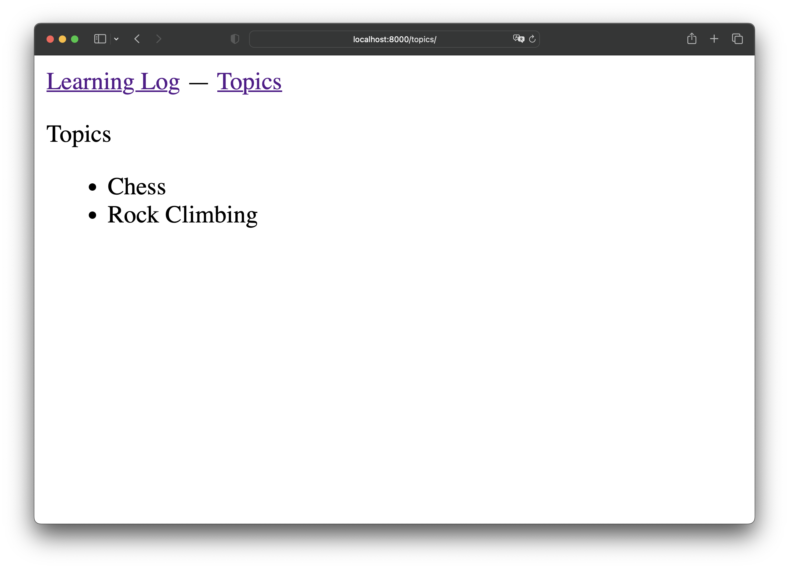

# 🌟Проект learning\_log

Page not found (404)Создайте для проекта новый каталог с именем **learning\_log**, перейдите в этот каталог в терминальном режиме и создайте виртуальную среду следующими командами:

* **python** — Windows
* **python3** — macOS, Linux

```bash
python3 -m venv ll_env
```

Команда запускает модуль виртуальной среды **venv** и использует его для создания виртуальной среды с именем **ll\_env** (обратите внимание: в имени **ll\_env** две бук- вы **l**, а не одна).

## Активизация виртуальной среды

После того как виртуальная среда будет создана, ее необходимо активизировать следующей командой:

```bash
source ll_env/bin/activate
```

Команда запускает сценарий **activate** из каталога **ll\_env/bin**. Когда среда активизируется, ее имя выводится в круглых скобках.&#x20;

Теперь вы можете устанавливать пакеты в среде и использовать те пакеты, что были установлены ранее(глобально).&#x20;

Пакеты, установленные в **ll\_env**, будут доступны только в то время, пока среда остается активной.

<figure><figcaption><p>Создание и активация окружения</p></figcaption></figure>


Если вы работаете в системе **Windows**, используйте команду **ll\_env\ Scripts\activate** (без слова source) для активизации виртуальной среды. Если используете **PowerShell**, слово **Activate** должно начинаться с буквы верхнего регистра.


## Установка Django

После того как вы создали свою виртуальную среду и активизировали ее, установите Django:

```bash
pip install django
```

<figure><figcaption><p>Установка Django</p></figcaption></figure>

## Создание проекта в Django

Не выходя из активной виртуальной среды (пока **ll\_env** выводится в круглых скобках), введите следующие команды для создания нового проекта и автоматической генерации структуры / управляющих скриптов:

```bash
django-admin startproject learning_log . 
ls
ls learning_log
```

<figure><figcaption><p>Создание проекта, просмотр структуры</p></figcaption></figure>

Команда на изображении под номером **`1`** указывает Django создать новый проект с именем **learning\_log**. Точка в конце команды создает новый проект со структурой каталогов, которая упрощает развертывание приложения на сервере после завершения разработки.


**Не забывайте про точку**, иначе у вас могут возникнуть проблемы с конфигурацией при развертывании приложения. А если вы все же забыли, удалите созданные файлы и папки (кроме **ll\_env**) и снова выполните команду.


Команда **ls** (**dir** в Windows) на изображении под номером **`2`** показывает, что Django создает новый каталог с именем **learning\_log**. Также создается файл **manage.py** — короткая программа, которая получает команды и передает их соответствующей части Django для выполнения. Мы используем эти команды для управления такими задачами, как работа с базами данных и запуск серверов.

В каталоге **learning\_log** находятся 5 файлов на изображении под номером **`3`**, важнейшими из которых являются файлы **settings.py**, **urls.py**.&#x20;

Файл **settings.py** определяет то, как Django взаимодействует с вашей системой и управляет вашим проектом. Мы изменим некоторые из существующих настроек и добавим несколько новых настроек в ходе разработки проекта.&#x20;

Файл **urls.py** сообщает Django, какие страницы следует строить в ответ на запросы браузера.&#x20;

## Создание базы данных

Так как Django хранит большую часть информации в базе данных, относящейся к проекту, на следующем этапе необходимо создать базу данных, с которой Django сможет работать. Введите следующую команду (все еще не покидая активную среду):

```bash
python manage.py migrate
ls
```

<figure><figcaption><p>Создание базы данных SQLite</p></figcaption></figure>

Каждое изменение базы данных называется миграцией.&#x20;

Первое выполнение команды **`migrate`** указывает Django проверить, что база данных соответствует текущему состоянию проекта. Когда мы впервые выполняем эту команду в новом проекте с использованием SQLite, Django создает новую базу данных за нас.&#x20;

На изображении под номером **1** Django сообщает о создании и подготовке базы данных к хранению информации, необходимой для выполнения административных операций и аутентификации.

Выполнение команды **ls** показывает, что Django создает файл с именем db.sqlite3&#x20;

На изображении под номером **2**. SQLite — база данных, работающая с одним файлом; она идеально подходит для написания простых приложений.


В активной виртуальной среде для выполнения команд manage.py используется команда **python**, даже если для запуска других программ вы используете другую команду (например, **python3**). В виртуальной среде команда **python** относится к версии Python, создавшей виртуальную среду.


## Просмотр проекта

Убедимся в том, что проект был создан правильно. Введите команду **runserver** для просмотра текущего состояния проекта:

```bash
python manage.py runserver
```

<figure><figcaption></figcaption></figure>

Django запускает сервер, называемый сервером разработки, чтобы вы могли просмотреть проект в своей системе и проверить, как он работает.&#x20;

Когда вы запрашиваете страницу, вводя URL в браузере, сервер Django отвечает на запрос, для этого он строит соответствующую страницу и отправляет страницу браузеру.

Django проверяет правильность созданного проекта

На изображении под номером **2** возвращается URL-адрес, по которому доступен проект.&#x20;

**URL** [**http://127.0.0.1:8000/**](http://127.0.0.1:8000/) означает, что проект ведет прослушивание запросов на порте 8000 локального хоста (localhost), то есть вашего компьютера.&#x20;

Термином «локальный хост» обозначается сервер, который обрабатывает только запросы вашей системы; он не позволяет никому другому просмотреть разрабатываемые страницы.

Теперь откройте браузер и введите URL [http://localhost:8000/](http://localhost:8000/) — или [http://127.0.0.1:8000/](http://127.0.0.1:8000/), если первый адрес не работает.&#x20;

<figure><figcaption></figcaption></figure>

Вы увидите страницу, которую создает Django, чтобы сообщить вам, что все пока работает правильно. Пока не завершайте работу сервера (но когда вы захотите прервать ее, это можно сделать нажатием клавиш **Ctrl+C** в терминале, в котором была введена команда runserver).

## Начало работы над приложением

Проект Django представляет собой группу отдельных приложений, совместная работа которых обеспечивает работу проекта в целом. Пока мы создадим одно приложение, которое будет выполнять большую часть работы в нашем проекте. Другое приложение для управления учетными записями пользователей мы добавим позже

Произведите подключение проекта в удобную для Вас IDE, например PyCharm

**File — Open — learning\_log (найдите папку с проектом)**

PyCharm самостоятельно обнаружит **`venv`** и все необходимые настройки проекты, включая конфигурацию интерпретатора.&#x20;

<figure><figcaption><p>Открытие проекта в PyCharm</p></figcaption></figure>

Далее запустите проект 

<figure><figcaption><p>Запуск проекта в PyCharm</p></figcaption></figure>

При запуске Вас перенесет на вкладку **"Run"** в которой будет демонстрироваться состояние сервера.

Для удобства дальнейшего управления проектом, переключитесь на вкладку **"Terminal"**

<figure><figcaption><p>Переключение на вкладку Terminal</p></figcaption></figure>

## Создание приложения

Выполните команду **startapp**:

```bash
python manage.py startapp learning_logs
ls
```

<figure><figcaption></figcaption></figure>

Команда **startapp имя\_приложения** указывает Django создать инфраструктуру, необходимую для построения приложения.&#x20;

Заглянув сейчас в каталог проекта, вы найдете в нем новый подкаталог с именем learning\_logs. На изображении под номером **1**

Откройте этот каталог, чтобы увидеть, какие файлы были созданы Django. На изображении под номером **2**

Самые важные файлы в этом каталоге — models.py, admin.py и views.py.&#x20;

Файл models.py будет использоваться для определения данных, которыми нужно управлять в нашем приложении.&#x20;

К файлам admin.py и views.py мы вернемся позднее.

## Определение моделей

Подумаем, какие данные нам понадобятся. Каждый пользователь создает набор тем в своем журнале. Каждая запись, которую он сделает, будет привязана к определенной теме, а записи будут выводиться в текстовом виде. Также необходимо хранить временную метку каждой записи, чтобы пользователь знал, когда эта запись была создана.

Откройте файл **models.py** и просмотрите его текущее содержимое:


```python
from django.db import models

# Create your models here.
```


Модуль с именем **models** импортируется автоматически, и нам предлагается создать свои модели.&#x20;

Модель сообщает Django, как работать с данными, которые будут храниться в приложении.&#x20;

С точки зрения кода модель представляет собой обычный класс, она содержит атрибуты и методы, как и все остальные классы.&#x20;

Вот как выглядит модель тем обсуждения, которые будут сохраняться пользователями:


```python
...
class Topic(models.Model):
    """Тема, которую изучает пользователь"""
    text = models.CharField(max_length=200)
    date_added = models.DateTimeField(auto_now_add=True)

    def __str__(self):
        """Возвращает строковое представление модели."""
        return self.text
```


Мы создали класс с именем **Topic**, наследующий от **Model** — родительского класса, включенного в Django и определяющего базовую функциональность модели.&#x20;

В класс **Topic** добавляются два атрибута: **text** и **date\_added**.

Атрибут **`text`** содержит данные **CharField** — блок данных, состоящий из символов, то есть текст.&#x20;

Атрибуты **CharField** могут использоваться для хранения небольших объемов текста: имен, заголовков, названий городов и т. д.&#x20;

При определении атрибута **CharField** необходимо сообщить Django, сколько места нужно зарезервировать для него в базе данных.&#x20;

В данном случае задается максимальная длина **max\_length**, равная _200_ символам; этого должно быть достаточно для хранения большинства имен тем.

Атрибут **date\_added** содержит данные **DateTimeField** — блок данных для хранения даты и времени.&#x20;

Аргумент **auto\_add\_now=True** указывает Django автоматически присвоить этому атрибуту текущую дату и время каждый раз, когда пользователь создает новую тему.


Полный список всех полей, которые могут использоваться в модели, приведены в документе Django Model Field Reference [**https://docs.djangoproject.com/en/4.2/ref/models/fields/**](https://docs.djangoproject.com/en/4.2/ref/models/fields/)&#x20;


Необходимо сообщить Django, какой атрибут должен использоваться по умолчанию при вводе информации о теме.&#x20;

Django вызывает метод **str()** для вывода простого представления модели.&#x20;

Мы написали реализацию **str(),** которая возвращает строку, хранящуюся в атрибуте **text**.

## Активизация моделей

Чтобы использовать модели, необходимо указать Django включить приложение в общий проект. Откройте файл **settings.py** (из каталога **learning\_log/learning\_log**) и найдите в нем раздел, который сообщает Django, какие приложения установлены в проекте:


```python
...
INSTALLED_APPS = [
    'django.contrib.admin',
    'django.contrib.auth',
    'django.contrib.contenttypes',
    'django.contrib.sessions',
    'django.contrib.messages',
    'django.contrib.staticfiles',
]
...
```


<figure><figcaption><p>Настройки файла settings.py</p></figcaption></figure>

Добавьте наше приложение в этот список.&#x20;

Измените содержимое **INSTALLED\_APPS**, чтобы оно выглядело так:


```python
...
INSTALLED_APPS = [
    # Мои приложения
    'learning_logs',
    # Приложения django по умолчанию.
    'django.contrib.admin',
    ... 
]
...
```


Группировка приложений в проекте упрощает управление ими по мере того, как проект растет, а количество приложений увеличивается. Здесь мы создаем раздел, который пока содержит только приложение **learning\_logs**.&#x20;


Очень важно разместить свои приложения перед приложениями по умолчанию на случай, если вам понадобится переопределить поведение таких приложений.


Затем необходимо указать Django изменить базу данных для хранения информации, относящейся к модели **Topic**. В терминальном окне введите следующую команду:

```bash
python manage.py makemigrations learning_logs
```

По команде **makemigrations** Django определяет, как изменить базу данных для хранения информации, связанной с новыми моделями.&#x20;

Из результатов видно, что Django создает файл миграции с именем **0001\_initial.py**. Эта миграция создает в базе данных таблицу для модели **Topic**.

<figure><figcaption><p>makemigrations</p></figcaption></figure>

Можно открыть этот файл, чтобы увидеть, как выглядит миграция.

<figure><figcaption><p>0001_initial.py</p></figcaption></figure>

Рассмотрим код **SQL**, который будет выполняться в базе данных для создания таблицы для нашей модели. Команда **`sqlmigrate`** принимает имена миграции и возвращает их **SQL** без запуска. Выполните следующую команду для проверки выходных данных:

<figure><figcaption><p>sqlmigrate</p></figcaption></figure>

Теперь применим миграцию для автоматического изменения базы данных:

```bash
python manage.py migrate
```

<figure><figcaption><p>migrate</p></figcaption></figure>

Большая часть вывода этой команды совпадает с выводом, полученным при первом выполнении команды **migrate**.&#x20;

Обратить внимание следует на строку **Applying learning\_logs.0001\_initial... OK**  —  здесь Django подтверждает, что применение миграции для learning\_logs прошло успешно.

Каждый раз, когда вы захотите изменить данные, которыми управляет Learning Log, выполните эти три действия:&#x20;

* внесите изменения в **models.py**&#x20;
* вызовите **makemigrations** для **learning\_logs**
* укажите Django выполнить миграцию проекта (**migrate**).

## Административный сайт Django

Django позволяет легко работать с моделями, определенными для приложения, через **административный сайт**. Этот сайт используется администраторами сайта, а не рядовыми пользователями. В этом разделе мы создадим **административный сайт** и используем его для добавления некоторых тем через модель **Topic**.

### Создание суперпользователя

Django позволяет создать пользователя, обладающего полным набором привилегий на сайте, такой пользователь называется суперпользователем.&#x20;

Привилегии управляют действиями, которые разрешено выполнять пользователю. На самом жестком уровне привилегий пользователь может только читать общедоступную информацию на сайте. Зарегистрированным пользователям обычно предоставляется привилегия чтения своих приватных данных, а также избранной информации, доступной только для участников сообщества.&#x20;

Для эффективного администрирования веб-приложения владельцу сайта обычно должна быть доступна вся информация, хранящаяся на сайте.

Чтобы создать суперпользователя в Django, введите следующую команду и ответьте на запросы:

```bash
python manage.py createsuperuser
```

<figure><figcaption><p>createsuperuser</p></figcaption></figure>

При получении команды **createsuperuser** Django предлагает ввести имя пользователя, который является суперпользователем.&#x20;

Здесь мы вводим имя **admin**, но вы можете ввести любое имя на свое усмотрение.&#x20;

Также можно ввести адрес электронной почты или оставить это поле пустым.&#x20;

После этого следует дважды ввести пароль.

Если пароль будет очень простым Django предупредит об этом и запросит подтверждение.


Часть конфиденциальной информации может быть скрыта от администраторов сайта. Например, Django на самом деле не сохраняет введенный пароль, вместо этого сохраняется хеш — специальная строка, построенная на основе пароля. И когда в будущем вы вводите пароль, Django снова хеширует введенные данные и сравнивает результат с хранимым хешем. Если два хеша совпадают, то проверка пройдена. Если же злоумышленник в результате атаки получит доступ к базе данных сайта, то он сможет прочитать только хранящийся в базе хеш, но не пароли. При правильной настройке сайта восстановить исходные пароли из хешей почти невозможно.


### Регистрация модели на административном сайте

Django добавляет некоторые модели (например, **User** и **Group**) на административный сайт автоматически, но модели, которые мы создали, придется регистрировать вручную.

При запуске приложения **learning\_logs** Django создает файл **admin.py** в одном каталоге с **models.py**. Откройте файл **admin.py**:


```python
from django.contrib import admin

# Register your models here.
```


Чтобы зарегистрировать **Topic** на административном сайте, введите следующую команду:


```python
from django.contrib import admin
from .models import Topic

# Register your models here.
admin.site.register(Topic)
```


Этот код импортирует регистрируемую модель **Topic**.&#x20;

Точка перед **models** сообщает Django, что файл **models.py** следует искать в одном каталоге с **admin.py**.&#x20;

Вызов **admin.site.register()** сообщает Django, что управление моделью должно осуществляться через административный сайт.

Теперь используйте учетную запись суперпользователя для входа на административный сайт.&#x20;

Введите адрес [http://localhost:8000/admin/](http://localhost:8000/admin/), затем имя пользователя и пароль для только что созданного суперпользователя.

<figure><figcaption><p><a href="http://localhost:8000/admin/">http://localhost:8000/admin/</a></p></figcaption></figure>

На этой странице можно добавлять новых пользователей и группы, а также вносить изменения в уже существующие настройки.&#x20;

Также можно работать с данными, связанными с только что определенной моделью **Topic**.

### Добавление тем

Когда модель **Topic** была зарегистрирована на административном сайте, добавим первую тему.&#x20;

Щелкните на ссылке **Topics**, чтобы перейти к странице **Topics**

Страница практически пуста, потому что еще нет ни одной темы для выполнения операций. Щелкните на ссылке **Add Topic**, открывается форма для добавления новой темы.&#x20;

Введите в первом поле текст **Chess** и щелкните на ссылке **Save**.&#x20;

Вы возвращаетесь к административной странице **Topics**, на которой появляется только что созданная тема.

Создадим вторую тему, чтобы у вас было больше данных для работы.&#x20;

Снова щелкните на ссылке **Add Topic** и создайте вторую тему **Rock Climbing**. Ссылка Save снова возвращает вас к основной странице Topics, где отображаются обе темы, **Chess** и **Rock Climbing**.

<figure><figcaption><p>Add Topics</p></figcaption></figure>

## Определение модели Entry

Чтобы сохранить информацию о том, что вы узнали по этим двум темам, необходимо определить модель для записей, которые пользователь делает в своих журналах.&#x20;

Каждая запись должна ассоциироваться с конкретной темой.&#x20;

Такое отношение называется отношением «**многие к одному**», поскольку **многие** записи могут быть связаны с **одной** темой.

Код модели **Entry** (из файла **`models.py)`** выглядит так:


```python
from django.db import models
class Topic(models.Model):
...
class Entry(models.Model):
    """Информация, изученная пользователем по теме"""
    topic = models.ForeignKey(Topic, on_delete=models.CASCADE)
    text = models.TextField()
    date_added = models.DateTimeField(auto_now_add=True)

    class Meta:
        verbose_name_plural = 'entries'

    def __str__(self):
        """Возвращает строковое представление модели."""
        return f"{self.text[:50]}..."
```


Класс **Entry** наследует от базового класса **Model**, как и рассмотренный ранее класс **Topic**.&#x20;

Первый атрибут, **topic**, является экземпляром **ForeignKey**. Термин внешний ключ (**foreign key**) происходит из теории баз данных. Внешний ключ содержит ссылку на другую запись в базе данных. Таким образом каждая запись связывается с конкретной темой. Каждой теме при создании присваивается ключ, или идентификатор. Если потребуется установить связь между двумя записями данных, Django использует ключ, связанный с каждым блоком информации. Вскоре мы используем такие связи для получения всех записей, связанных с заданной темой. Аргумент **on\_delete=models.CASCADE** сообщает Django, что при удалении темы все записи, связанные с этой темой, также должны быть удалены (**это называется каскадным удалением**).

Затем идет атрибут с именем **text**, который является экземпляром **TextField**. Полю такого типа ограничение размера не требуется, потому что размер отдельных записей не ограничивается. Атрибут **date\_added** позволяет отображать записи в порядке их создания и снабжать каждую запись временной меткой.

Класс **Meta** вкладывается в класс **Entry**. Класс **Meta** хранит дополнительную информацию по управлению моделью, в данном случае он позволяет задать специальный атрибут, который указывает Django использовать форму множественного числа **Entries** при обращении более чем к одной записи.&#x20;


Без этого Django будет использовать неправильную форму **Entrys**.


Метод **\_\_str\_\_()** сообщает Django, какая информация должна отображаться при обращении к отдельным записям. Так как запись может быть достаточно длинным блоком текста, мы указываем Django выводить только первые 50 символов. Также добавляется многоточие — признак вывода неполного текста.

## Миграция модели Entry

Так как мы добавили новую модель, миграцию базы данных необходимо провести снова. Вскоре вы привыкнете к этому процессу:&#x20;

* вы изменяете **models.py**
* выполняете команду **python manage.py makemigrations имя\_приложения**
* затем команду **python manage.py migrate**

Проведите миграцию базы данных и проверьте вывод:

```bash
python manage.py makemigrations learning_logs
python manage.py migrate
```

<figure><figcaption><p>makemigrations &#x26; migrate</p></figcaption></figure>

Команда генерирует новую миграцию с именем **0002\_entry.py**, которая сообщает Django, как изменить базу данных для хранения информации, связанной с моделью  **Entry**.&#x20;

При выполнении команды **migrate** Django подтверждает, что применение миграции прошло успешно.

## Регистрация Entry на административном сайте

Модель **Entry** тоже необходимо зарегистрировать. Файл **admin.py** должен выглядеть так:


```python
from django.contrib import admin
from .models import Topic, Entry

# Register your models here.
admin.site.register(Topic)
admin.site.register(Entry)
```


Вернитесь на страницу [http://localhost/admin/](http://localhost/admin/) или [http://127.0.0.1/admin/](http://127.0.0.1/admin/), и вы увидите раздел **Entries** в категории **learning\_logs**.&#x20;

Щелкните на ссылке **Add** для **Entries** или щелкните на **Entries** и выберите вариант **Add**.&#x20;

На экране появляется раскрывающийся список для выбора темы, для которой создается запись, и текстовое поле для ввода записи. Выберите в раскрывающемся списке вариант **Chess** и добавьте запись.

При выборе ссылки **Save** вы вернетесь к основной административной странице. Здесь проявляются преимущества использования формата **text\[:50]** в качестве строкового представления каждой записи. Работать с большим количеством записей в административном интерфейсе намного удобнее, если вы видите только часть записи вместо ее полного текста.

<figure><figcaption><p>Add new entry</p></figcaption></figure>


Создайте вторую запись для темы **Chess** и одну запись для темы **Rock Climbing**, чтобы у нас были исходные данные для дальнейшей разработки приложения. Всего должно быть 3 записи.


<figure><figcaption><p>All <a href="http://localhost:8000/admin/learning_logs/entry/">Entries</a></p></figcaption></figure>

## Интерактивная оболочка Django

Введенные данные можно проанализировать на программном уровне в интерактивном терминальном сеансе.&#x20;

Эта интерактивная среда, называемая оболочкой (**shell**) Django, прекрасно подходит для тестирования и диагностики проекта. Пример сеанса в интерактивной оболочке:

```
python manage.py shell
```

```python
>>> from learning_logs.models import Topic
>>> Topic.objects.all()
```

<figure><figcaption></figcaption></figure>

Команда **python manage.py shell** (выполняемая в активной виртуальной среде) запускает интерпретатор Python, который может использоваться для работы с информацией в базе данных проекта.&#x20;

В данном случае мы импортируем модель **Topic** из модуля **learning\_logs.models**. Затем метод **Topic.objects.all()** используется для получения всех экземпляров модели **Topic,** возвращаемый список называется итоговым набором (**queryset**).

Содержимое итогового набора перебирается точно так же, как и содержимое списка. Например, просмотр идентификаторов, назначенных каждому объекту темы, выполняется так:

```python
>>> topics = Topic.objects.all() 
>>> for topic in topics:
... print(topic.id, topic)
...
1 Chess
2 Rock Climbing
```

<figure><figcaption></figcaption></figure>

Итоговый набор сохраняется в переменную **topics**, после чего выводится атрибут **id** каждого объекта **topic** и его строковое представление. Мы видим, что теме **Chess** присвоен идентификатор **1**, а **Rock Climbing** присвоен идентификатор **2**.

Зная идентификатор конкретного объекта, можно при помощи метода **Topic.objects.get()** получить этот объект и проанализировать содержащиеся в нем атрибуты.&#x20;

Просмотрим значения **text** и **date\_added** для темы **Chess**:

```python
>>> t = Topic.objects.get(id=1)
>>> t.text
'Chess'
>>> t.date_added
datetime.datetime(2023, 9, 4, 17, 18, 2, 39019, tzinfo=datetime.timezone.utc)
```

<figure><figcaption></figcaption></figure>

Также можно просмотреть записи, относящиеся к конкретной теме. Ранее мы определили атрибут **topic** для модели **Entry**. Он был экземпляром **ForeighKey**, представляющим связь между записью и темой.&#x20;

Django может использовать эту связь для получения всех записей, относящихся к некоторой теме:

```bash
>>> t.entry_set.all()
<QuerySet [<Entry: Lorem ipsum dolor sit amet, consectetur adipiscing...>, 
<Entry: It is a long established fact that a reader will b...>]>
```

Чтобы получить данные через отношение внешнего ключа, воспользуйтесь **именем связанной модели**, записанным в **нижнем регистре**, за которым следует символ **подчеркивания** и слово **set**.&#x20;

Допустим, у вас имеются модели **Pizza** и **Topping** и модель **Topping** связана с **Pizza** через внешний ключ.&#x20;

Если ваш объект называется **my\_pizza**, для получения всех связанных с ним экземпляров **Topping** используется выражение **my\_pizza.topping\_set.all()**.

Мы будем использовать такой синтаксис при переходе к программированию страниц, которые могут запрашиваться пользователями.&#x20;

Оболочка очень удобна тогда, когда вы хотите проверить, что ваш код получает нужные данные.&#x20;

Если в оболочке код работает так, как задумано, можно ожидать, что он будет правильно работать и в файлах, которые вы создаете в своем проекте.

Если код выдает ошибки или не загружает те данные, которые должен загружать, вам будет намного проще отладить его в простой оболочке, чем при работе с файлами, генерирующими веб-страницы.


При каждом изменении модели необходимо перезапустить оболочку, чтобы увидеть результаты этих изменений. Чтобы завершить сеанс работы с оболочкой, нажмите **Сtrl+D**, в Windows нажмите **Ctrl+Z**, а затем **Enter**.


## Создание страниц: домашняя страница Learning Log

Обычно процесс создания веб-страниц в Django состоит из трех стадий:&#x20;

1. определения URL
2. написания представлений
3. написания шаблонов.&#x20;

Сначала следует определить схемы (**patterns**) **URL**. Схема URL описывает структуру URL-адреса и сообщает Django, на какие компоненты следует обращать внимание при сопоставлении запроса браузера с URL-адресом на сайте, чтобы выбрать возвращаемую страницу.

Затем каждый URL-адрес связывается с конкретным представлением — функция представление читает и обрабатывает данные, необходимые странице.&#x20;

Функция представления часто вызывает шаблон, который строит страницу, подходящую для передачи браузеру.&#x20;

Чтобы вы лучше поняли, как работает этот механизм, создадим домашнюю страницу для приложения **Learning Log**. Мы определим URL-адрес домашней страницы, напишем для него функцию представления и создадим простой шаблон.

Так как мы сейчас всего лишь убеждаемся в том, что **Learning Log** работает как положено, страница пока останется простой. Когда приложение будет завершено, вы можете заниматься его оформлением сколько угодно. Пока на домашней странице будет отображаться только заголовок и краткое описание.

## Сопоставление URL

Пользователь запрашивает страницы, вводя URL-адреса в браузере и переходит по ссылкам, поэтому мы должны решить, какие URL-адреса понадобятся в нашем проекте.&#x20;

Начнем с **URL домашней страницы**: это базовый адрес, используемый для обращения к проекту.&#x20;

На данный момент базовый URL-адрес [http://localhost:8000/](http://localhost:8000/) возвращает сайт, сгенерированный Django по умолчанию, он сообщает о том, что проект был создан успешно. Мы изменим домашнюю страницу, связав базовый URL-адрес с домашней страницей **Learning Log**.

В каталоге проекта **learning\_log** откройте файл **urls.py**. Вы увидите в нем следующий код:


```python
"""
URL configuration for learning_log project.

The `urlpatterns` list routes URLs to views. For more information please see:
    https://docs.djangoproject.com/en/4.2/topics/http/urls/
Examples:
Function views
    1. Add an import:  from my_app import views
    2. Add a URL to urlpatterns:  path('', views.home, name='home')
Class-based views
    1. Add an import:  from other_app.views import Home
    2. Add a URL to urlpatterns:  path('', Home.as_view(), name='home')
Including another URLconf
    1. Import the include() function: from django.urls import include, path
    2. Add a URL to urlpatterns:  path('blog/', include('blog.urls'))
"""
from django.contrib import admin
from django.urls import path

urlpatterns = [
    path('admin/', admin.site.urls),
]
```


Первые две строки импортируют функции и модули, управляющие URL-адресами проекта и административным сайтом.&#x20;

В теле файла определяется переменная **urlpatterns**. В файле **urls.py**, представляющем проект в целом, переменная **urlpatterns** включает наборы URL-адресов из приложений в проект.&#x20;

Код **`path('admin/', admin.site.urls)`** включает модуль **admin.site.urls**, определяющий все URL-адреса, которые могут запрашиваться с административного сайта.

Изменим в этом файле URL-адреса **learning\_logs**:

```python
from django.contrib import admin
from django.urls import path, include

urlpatterns = [
    path('admin/', admin.site.urls),
    path('', include('learning_logs.urls'))
]
```

Файл **urls.py** по умолчанию находится в каталоге **learning\_log**&#x20;

Теперь нужно создать второй файл **urls.py** в папке **learning\_logs**.&#x20;

Создайте новый файл Python, сохраните его под именем **urls.py** в **learning\_logs** и включите в него следующий код:

```bash
learning_log/learning_logs/urls.py
```


```python
"""Определяет схемы URL для learning_logs."""

from django.urls import path
from . import views

app_name = 'learning_logs'
urlpatterns = [
    # Домашняя страница
    path('', views.index, name='index'),
]
```


Чтобы было понятно, с какой версией **urls.py** мы работаем, в начало файла добавляется строка документации.&#x20;

Затем импортируется функция **path**, она необходима для связывания URL с представлениями.&#x20;

Также импортируется модуль **views**, точка указывает Python импортировать представления из каталога, в котором находится текущий модуль **urls.py**.&#x20;

Переменная **app\_name** помогает Django отличить этот файл **urls.py** от одноименных файлов в других приложениях в проекте.&#x20;

Переменная **urlpatterns** в этом модуле представляет собой список страниц, которые могут запрашиваться из приложения **learning\_logs**.

Схема URL представляет собой вызов функции **path()** с **тремя** аргументами.&#x20;

**Первый** аргумент содержит строку, которая помогает Django правильно маршрутизировать текущий запрос.&#x20;

Django получает запрашиваемый URL и пытается отобразить его на представление.&#x20;

Для этого Django ищет среди всех определенных схем URL ту, которая соответствует текущему запросу.&#x20;

Базовый URL-адрес проекта ([http://localhost:8000/](http://localhost:8000/)) игнорируется, так что пустая строка совпадает с базовым URL-адресом.&#x20;

Любой другой URL-адрес не будет соответствовать этому выражению, и Django вернет страницу с ошибкой, если запрашиваемый URL не соответствует ни одной из существующих схем URL.

**Второй** аргумент **path()** определяет вызываемую функцию из **views.py**.&#x20;

Когда запрашиваемый URL-адрес соответствует регулярному выражению, Django вызывает **index()** из **views.py** (мы напишем эту функцию далее).&#x20;

**Третий** аргумент определяет имя **index** для этой схемы URL, чтобы на нее можно было ссылаться в других частях кода.&#x20;

Каждый раз, когда потребуется предоставить ссылку на домашнюю страницу, мы будем использовать это имя вместо URL.

## Написание представления

Функция представления получает информацию из запроса, подготавливает данные, необходимые для построения страницы, и возвращает данные браузеру — часто с использованием шаблона, определяющего внешний вид страницы.

Файл **views.py** в **learning\_logs** был сгенерирован автоматически при выполнении команды **`python manage.py startapp`**&#x20;

На данный момент его содержимое выглядит так:


```python
from django.shortcuts import render

# Create your views here.
```


Сейчас файл только импортирует функцию **render()**, которая генерирует ответ на основании данных, полученных от представлений. Откройте файл представления и добавьте следующий код домашней страницы:


```python
...
def index(request):
    """Домашняя страница приложения Learning Log"""
    return render(request, 'learning_logs/index.html')
```


Если URL запроса совпадает с только что определенной схемой, Django ищет в файле **views.py** функцию с именем **index()**, после чего передает этой функции представления объект **request**.&#x20;

В нашем случае никакая обработка данных для страницы не нужна, поэтому код функции сводится к вызову **render()**. Функция **render()** использует **два** аргумента — **исходный объект запроса** и **шаблон**, используемый для построения страницы. Давайте напишем этот шаблон.

## Написание шаблона

Шаблон определяет общий внешний вид страницы, а Django заполняет его соответствующими данными при каждом запросе страницы.&#x20;

Шаблон может обращаться к любым данным, полученным от представления.&#x20;

Так как наше представление домашней страницы никаких данных не предоставляет, шаблон получается относительно простым.

В каталоге **learning\_logs** создайте новый каталог с именем **templates**. В каталоге **templates** создайте другой каталог с именем **learning\_logs**.&#x20;

На первый взгляд такая структура кажется избыточной (каталог **learning\_logs** в каталоге **templates** внутри каталога **learning\_logs**), но созданная таким образом структура будет однозначно интерпретироваться Django даже в контексте большого проекта, состоящего из множества отдельных приложений.&#x20;

Во внутреннем каталоге **learning\_logs** создайте новый файл с именем **index.html**&#x20;

Таким образом, полное имя файла имеет вид **`learning_log/learning_logs/templates/learning_logs/index.html`**&#x20;

Включите в него следующий текст:


```html
<p>Learning Log</p>
<p>Learning Log helps you!</p>
```


Это очень простой файл. Если вы не знакомы с синтаксисом HTML, теги обозначают абзацы.

Теперь при запросе базового URL-адреса проекта [http://localhost:8000/](http://localhost:8000/) вы увидите только что построенную страницу вместо страницы по умолчанию.&#x20;

Django берет запрошенный URL-адрес и видит, что он совпадает со схемой ""

В этом случае Django вызывает функцию **views.index()**, что приводит к построению страницы с использованием шаблона, содержащегося в **index.html**.&#x20;

<figure><figcaption></figcaption></figure>

И хотя может показаться, что для одной страницы этот процесс слишком сложен, такое разделение URL-адресов, представлений и шаблонов работает хорошо.&#x20;

Оно позволяет сосредоточиться на отдельных аспектах проекта, а в более **крупных проектах** отдельные участники могут сосредоточиться на тех областях, в которых они наиболее сильны.&#x20;

Например, специалист по базам данных может заняться моделями, программист — кодом представления, а дизайнер — шаблонами.

## Построение других страниц

Теперь, когда вы начали представлять процесс построения страниц, можно переходить к построению проекта **Learning Log**.&#x20;

Мы создадим **две** страницы для вывода данных:&#x20;

* на одной будет выводиться список всех тем
* на другой — все записи по конкретной теме.&#x20;

Для каждой страницы мы создадим схему URL, напишем функцию представления и создадим шаблон.&#x20;

Но прежде чем переходить к работе, стоит создать **базовый шаблон**, от которого будут **наследовать** все шаблоны этого проекта.

### Наследование шаблонов

При построении сайта некоторые элементы почти всегда повторяются на каждой странице. Вместо того чтобы встраивать эти элементы непосредственно в страницы, вы можете написать базовый шаблон с повторяющимися элементами

Все страницы будут наследовать от этого шаблона. Такое решение позволит сосредоточиться на разработке уникальных аспектов каждой страницы и существенно упростит изменение общего оформления проекта в целом.

#### Родительский шаблон

Начнем с создания шаблона **base.html** в одном каталоге с файлом **index.html**&#x20;

Этот файл будет содержать элементы, общие для всех страниц, все остальные шаблоны наследуют от **base.html**.&#x20;

Пока единственным элементом, который должен повторяться на каждой странице, остается **заголовок** в верхней части страницы.&#x20;

Так как шаблон будет включаться в каждую страницу, преобразуем заголовок в ссылку на домашнюю страницу:


```html
<p>
<a href="
">Learning Log</a>
</p>


```


Первая часть файла создает абзац с именем проекта, который также работает как ссылка на домашнюю страницу. Для построения ссылки использовался шаблонный тег, обозначенный фигурными скобками и знаками процента \{% %\}. Шаблонный тег представляет собой блок кода, который генерирует информацию для вывода на странице. В данном примере шаблонный тег генерирует URL-адрес, соответствующий схеме URL, определенной в файле **`learning_logs/urls.py`** с именем '**index**'.&#x20;

В данном примере **learning\_logs** — пространство имен, а **index** — схема URL с уникальным именем в этом пространстве имен.

Пространство имен определяется значением, присвоенным **app\_name** в файле **`learning_logs/urls.py`**

В этой простой странице HTML ссылка заключается в якорный тег:

```html
<a href="url_ссылки">текст ссылки</a>
```

Генерирование URL-адреса шаблонным тегом существенно упрощает актуализацию ссылок. Чтобы изменить URL-адрес в проекте, достаточно изменить схему URL в **urls.py**, а Django автоматически вставит обновленный URL-адрес при следующем запросе страницы.&#x20;

Каждая страница в проекте будет наследовать от **base.html**, так что в дальнейшем на каждой странице будет содержаться ссылка на домашнюю страницу.

Также в **base.html** вставляется пара тегов **block**.&#x20;

Блок с именем **content** резервирует место

Информация, попадающая в блок **content**, будет определяться **дочерним шаблоном**.

**Дочерний шаблон** не обязан определять каждый блок в своем родителе, так что в родительских шаблонах можно зарезервировать место для любого количества блоков, а дочерний шаблон будет использовать столько из них, сколько потребуется.

#### Дочерний шаблон

Теперь нужно переписать файл **index.html** так, чтобы он наследовал от **base.html**

Обновленный файл **index.html** выглядит так:


```django



    <p>Learning Log helps you!</p>


```


Сравнивая этот файл с исходной версией **index.html**, мы видим, что заголовок **Learning Log** заменен кодом наследования от родительского шаблона.&#x20;

В первой строке дочернего шаблона должен находиться тег, который сообщает Django, от какого родительского шаблона он наследует. \\

Файл **base.html** является частью **learning\_logs**, поэтому **learning\_logs** включается в путь к родительскому шаблону. Эта строка извлекает все содержимое из шаблона **base.html** и позволяет **index.html** определить, что должно попасть в пространство, зарезервированное блоком **content**.

Блок **content** определяется вставкой тега **``** с именем **content**. Все, что не наследуется от родительского шаблона, попадает в блок **content**.&#x20;

В данном случае это абзац с описанием проекта **Learning Log**.&#x20;

При помощи тега **``** мы сообщаем о том, что определение **content** завершено

Наличие имени у **``** не обязательно, но если шаблон увеличится и станет включать несколько блоков, будет полезно сразу видеть, какой именно блок завершается.

Преимущества **наследования шаблонов**:&#x20;

В дочерний шаблон достаточно включить информацию, уникальную для этой страницы. Т

Такой подход не только упрощает каждый шаблон, но и значительно упрощает изменение сайта.&#x20;

Чтобы изменить элемент, общий для многих страниц, достаточно изменить элемент в родительском шаблоне.&#x20;

Внесенные изменения будут автоматически перенесены на каждую страницу, наследующую от этого шаблона.&#x20;

В проекте из десятков и сотен страниц такая структура значительно упрощает и ускоряет доработку сайта.


В больших проектах часто создается один родительский шаблон **base.html** для всего сайта и родительские шаблоны для каждого крупного раздела сайта. Все шаблоны разделов наследуют от **base.html**, и каждая страница сайта наследует от шаблона раздела. При такой структуре вы сможете легко изменять оформление и поведение сайта в целом, любого его раздела или отдельной страницы. Данная конфигурация сильно повышает эффективность работы.


## Страница со списком тем

Разобравшись с тем, как эффективно организовать построение страниц, мы можем сосредоточиться на следующих двух страницах:&#x20;

* списке всех тем&#x20;
* списке записей по одной теме.&#x20;

На странице тем выводится перечень всех тем, созданных пользователями, и это первая страница, на которой нам придется работать с данными.

### Схема URL для тем

Сначала нужно определить URL для страницы тем. Обычно в таких случаях выбирается простой фрагмент URL, который отражает суть информации, представленной на странице. Мы воспользуемся словом **topics**, так что для получения страницы будет использоваться URL [http://localhost:8000/topics/](http://localhost:8000/topics/)

Изменения, которые следует внести в **learning\_logs/urls.py**:

```python
# Страница со списком всех тем.
path('topics/', views.topics, name='topics')
```


```python
"""Определяет схемы URL для learning_logs."""

from django.urls import path
from . import views

app_name = 'learning_logs'
urlpatterns = [
    # Домашняя страница
    path('', views.index, name='index'),
    # Страница со списком всех тем.
    path('topics/', views.topics, name='topics'),
]
```


Мы просто добавили **topics/** в аргумент регулярного выражения, используемый с URL-адресом домашней страницы.&#x20;

Когда Django проверяет запрашиваемый URL-адрес, эта схема совпадет с любым URL-адресом, который состоит из базового URL-адреса и слова **topics**.&#x20;

Слеш в конце можно включить, а можно не включать, но после слова **topics** ничего быть не должно, иначе схема не совпадет.&#x20;

Любой запрос с URL-адресом, соответствующим этой схеме, будет передан функции **topics()** в **views.py**

### Представление topics

Функция **topics()** должна получать данные из базы данных и отправлять их шаблону. Обновленная версия **views.py** выглядит так:


```python
from django.shortcuts import render
from .models import Topic


# Create your views here.
def index(request):
    """Домашняя страница приложения Learning Log"""
    return render(request, 'learning_logs/index.html')


def topics(request):
    """Выводит список тем."""
    topics = Topic.objects.order_by('date_added')
    context = {'topics': topics}
    return render(request, 'learning_logs/topics.html', context)
```


Сначала импортируется модель, связанная с нужными данными.&#x20;

Функции **topics()** необходим **один** параметр: объект **request**, полученный Django от сервера.&#x20;

**topics = Topic.objects.order\_by('date\_added')** — выдается запрос к базе данных на получение объектов **Topic**, отсортированных по атрибуту **date\_added**.&#x20;

Полученный итоговый набор сохраняется в **topics**.

**return render(request, 'learning\_logs/topics.html', context)** — определяется контекст, который будет передаваться шаблону.&#x20;

Контекст представляет собой словарь, в котором **ключами** являются **имена**, используемые в шаблоне для обращения к данным, а **значениями** — **данные**, которые должны передаваться шаблону.&#x20;

В данном случае существует всего одна пара «ключ-значение», которая содержит набор тем, отображаемых на странице.&#x20;

При построении страницы, использующей данные, функции **render()** передается переменная **context**, а также объект **request** и **путь к шаблону**.

### Шаблон topics

Шаблон страницы со списком тем получает словарь **context**, чтобы шаблон мог использовать данные, предоставленные **topics()**. Создайте файл с именем **topics.html** в одном каталоге с **index.html**&#x20;

Вывод списка тем в шаблоне осуществляется следующим образом:


```django



  <p>Topics</p>
  <ul>
    
      <li>{{ topic }}</li>
    
      <li>No topics ¯\_(ツ)_/¯</li>
    
  </ul>


```


Сначала тег объявляет о наследовании от **base.html**, как и в случае с шаблоном **index**, после чего открывается блок **content**. Тело страницы содержит маркированный (**bulleted**) список введенных тем.&#x20;

Внутри списка **`<ul>`** находится другой шаблонный тег, эквивалентный циклу **for**, для пере- бора списка **topics** из словаря **context**.&#x20;

Код, используемый в шаблоне, отличается от Python некоторыми важными особенностями. Python использует отступы для обозначения строк, входящих в тело цикла. В шаблоне каждый цикл for должен снабжаться явным тегом **``**, обозначающим конец цикла. Таким образом, в шаблонах часто встречаются циклы следующего вида:

```django

 
действия для каждого элемента


```

В цикле каждая тема должна быть преобразована в элемент маркированного списка **\<li>**

Чтобы вывести значение переменной в шаблоне, заключите ее имя в **двойные фигурные скобки**.&#x20;

Фигурные скобки на странице не появятся, они всего лишь сообщают Django об использовании шаблонной переменной.&#x20;

Код **`{{ topic }}`** будет заменен значением **topic** при каждом проходе цикла.&#x20;

Шаблонный тег **``**,сообщает Django, что делать при отсутствии элементов в списке.&#x20;

В нашем примере выводится сообщение о том, что темы еще не созданы. Последние две строки завершают цикл for и маркированный список.

Затем необходимо изменить базовый шаблон и включить ссылку на страницу с темами. Добавьте следующий код в **base.html**:

```html
<a href="

">Topics</a>
```


```html
<p>
    <a href="
">Learning Log</a> —
    <a href="">Topics</a>
</p>


```


После ссылки на домашнюю страницу добавляется дефис, после которого вставляется ссылка на страницу тем, которая также представлена шаблонным тегом.

Эта строка указывает Django сгенерировать ссылку, соответствующую схеме URL с именем '**topics**' в **learning\_logs/urls.py**

Обновив домашнюю страницу в браузере, вы увидите ссылку [**Topics**](http://localhost:8000/topics/)

<figure><figcaption></figcaption></figure>

### Страницы отдельных тем

Следующим шагом станет создание страницы для вывода информации по одной теме, с названием темы и всеми записями по этой теме.&#x20;

Мы снова определим новую схему URL, напишем представление и создадим шаблон.&#x20;

Кроме того, на странице со списком тем каждый элемент маркированного списка будет преобразован в ссылку на соответствующую страницу отдельной темы.

### Схема URL для отдельных тем

Схема URL для страницы отдельной темы немного отличается от других схем URL, которые встречались нам ранее, потому что в ней используется атрибут **id** темы для обозначения запрашиваемой темы.&#x20;

Например, если пользователь хочет просмотреть страницу с подробной информацией по теме **Chess (id=1)**, эта страница будет иметь URL-адрес [http://localhost:8000/topics/1/](http://localhost:8000/topics/1/)

Вот как выглядит схема для этого URL-адреса из **learning\_logs/urls.py**:


```python
...
urlpatterns = [
...
    # Страница с подробной информацией по отдельной теме
    path('topics/<int:topic_id>/', views.topic, name='topic'),
]
```


Рассмотрим строку '**`topics/int:topic_id/`**' в этой схеме URL.&#x20;

Первая часть строки сообщает Django, что искать следует URL-адреса, у которых за базовым адресом идет слово **topics**.&#x20;

Вторая часть строки, **`/int:topic_id/`**, описывает целое число, заключенное между двумя слешами. Это целое число сохраняется в аргументе **topic\_id**.

Когда Django находит URL-адрес, соответствующий этой схеме, вызывается функция представления **topic()**, в аргументе которой передается значение, хранящееся в **topic\_id**.&#x20;

Значение **topic\_id** используется для получения нужной темы внутри функции.

### Представление отдельной темы

Функция **topic()** должна получить тему и все связанные с ней записи из базы данных:


```python
...
def topic(request, topic_id):
    """Выводит одну тему и все ее записи."""
    topic = Topic.objects.get(id=topic_id)
    entries = topic.entry_set.order_by('-date_added')
    context = {'topic': topic, 'entries': entries}
    return render(request, 'learning_logs/topic.html', context)
```


Это первая функция представления, которой требуется параметр, отличный от объекта request.&#x20;

Функция получает значение, совпавшее с выражением **/int:topic\_id/**, и сохраняет его в **topic\_id**  < `def topic(request, topic_id) >`

`topic = Topic.objects.get(id=topic_id)` — функция get() используется для получения темы (по аналогии с тем, как мы это делали в оболочке Django).&#x20;

`entries = topic.entry_set.order_by('-date_added')` — загружаются записи, связанные с данной темой, и они упорядочиваются по значению **date\_added**: знак «минус» перед **date\_added** сортирует результаты в обратном порядке, то есть самые последние записи будут находиться на первых местах.&#x20;

Тема и записи сохраняются в словаре **context** — `context = {'topic': topic, 'entries': entries}`, который передается шаблону **topic.html** — `return render(request, 'learning_logs/topic.html', context)`


Выражения в строках topic = **`Topic.objects.get(id=topic_id)`** и **`entries = topic.entry_set.order_by('-date_added')`**, обращающиеся к базе данных за конкретной информацией, называются **запросами**. Когда вы пишете подобные запросы для своих проектов, сначала опробуйте их в [оболочке Django(shell)](proekt-learning\_log.md#interaktivnaya-obolochka-django). Вы сможете проверить результат намного быстрее, чем если напишете представление и шаблон, а затем проверите результаты в браузере.


### Шаблон отдельной темы

В шаблоне должно отображаться название темы и текст записей. Также необходимо сообщить пользователю, если по теме еще не было сделано ни одной записи:


```django



  <p>Topic: {{ topic }}</p>
  <p>Entries:</p>
  <ul>
  
    <li>
      <p>{{ entry.date_added|date:'M d, Y H:i' }}</p>
      <p>{{ entry.text|linebreaks }}</p>
    </li>
  
    <li>There are no entries for this topic yet ¯\_(ツ)_/¯</li>
  
  </ul>


```


Шаблон расширяет **base.html**, как и для всех страниц проекта.&#x20;

Затем выводится текущая тема из шаблонной переменной **\{{ topic \}}**:

```django
<p>Topic: {{ topic }}</p>
```

Переменная **topic** доступна, потому что она включена в словарь **context**.&#x20;

Затем создается маркированный список со всеми записями по теме **\<ul>**

Перебор записей осуществляется так же, как это делалось ранее для тем:

```django



```

С каждым элементом списка связываются два значения: временная метка и полный текст каждой записи.&#x20;

Для временной метки выводится значение атрибута **date\_added**.

```django
<p>{{ entry.date_added|date:'M d, Y H:i' }}</p>
```

В шаблонах Django вертикальная черта (|) представляет фильтр — функцию, изменяющую значение шаблонной переменной.&#x20;

Фильтр **date:'M d, Y H:i'** выводит временные метки в формате **January 1, 2023 23:00**.&#x20;

Следующая строка выводит полное значение **text** (вместо первых 50 символов каждой записи).&#x20;

Фильтр **linebreaks**

```django
<p>{{ entry.text|linebreaks }}</p>
```

Он следит за тем, чтобы длинный текст содержал разрывы строк в формате, поддерживаемом браузером (вместо блока непрерывного текста).&#x20;

Шаблонный тег **``** используется для вывода сообщения об отсутствии записей.

### Ссылки на странице

Прежде чем просматривать страницу отдельной темы в браузере, необходимо изменить шаблон списка тем, чтобы каждая тема вела на соответствующую страницу.&#x20;

Внесите следующие изменения в **topics.html**:


```django
...
    

        <li>
            <a href="">{{ topic }}</a>
        </li>
    

...
```


Шаблонный тег URL используется для генерирования ссылки на основании схемы URL из **learning\_logs** с именем '**topic**'.&#x20;

Этой схеме URL необходим аргумент **topic\_id**, поэтому в шаблонный тег URL добавляется атрибут **topic.id**. Теперь каждая тема в списке представляет собой ссылку на страницу темы, например [http://localhost:8000/topics/1/](http://localhost:8000/topics/1/)

Если теперь обновить страницу тем и перейти на любую тему, открывается страница с записями


learning\_logs Topics



Между **topic.id** и **topic\_id** существует неочевидное, но важное различие. Выражение **topic.id** проверяет тему и получает значение соответствующего идентификатора. Переменная **topic\_id** содержит ссылку на этот идентификатор в коде.


## Учетные записи пользователей

Что является самым главным для веб-приложения? Любой пользователь, сможет создать учетную запись в вашем приложении и начать работать с ним. Мы построим формы, в которых пользователи смогут вводить свои темы и записи, а также редактировать существующие данные.&#x20;

Также вы узнаете, как Django защищает приложения от распространенных атак на страницы с формами, чтобы вам не приходилось тратить много времени на продумывание средств защиты вашего приложения.

Затем будет реализована система проверки пользователей. Мы создадим страницу регистрации, на которой пользователи смогут создавать учетные записи, и ограничим доступ к некоторым страницам для анонимных пользователей. Затем некоторые функции представления будут изменены так, чтобы **пользователь мог видеть только свои собственные данные**. Вы узнаете, как обеспечить безопасность и конфиденциальность данных пользователей.

### Редактирование данных

Прежде чем строить систему аутентификации пользователей для создания учетных записей, сначала мы добавим несколько страниц, на которых пользователи смогут вводить собственные данные.&#x20;

У пользователей появится возможность создавать новые темы, добавлять новые записи и редактировать записи, сделанные ранее.

В настоящее время данные могут вводиться только суперпользователем на административном сайте.&#x20;

Однако разрешать пользователям работу на административном сайте явно нежелательно, поэтому мы воспользуемся **средствами построения форм** Django для создания страниц, на которых пользователи смогут вводить данные.

#### Добавление новых тем

Начнем с возможности создания новых тем. Страницы на базе форм добавляются практически так же, как и те страницы, которые мы уже строили ранее:&#x20;

* **определяете URL**, **пишете функцию представления** и **создаете шаблон**. Принципиальное отличие — **добавление нового модуля forms.py**, содержащего функциональность форм.

#### Объект ModelForm

Любая страница, на которой пользователь может вводить и отправлять информацию, является формой, даже если на первый взгляд она на форму не похожа.&#x20;

Когда пользователь вводит информацию, необходимо проверить, что он ввел корректные данные, а не вредоносный код (например, код для нарушения работы сервера).&#x20;

Затем проверенная информация обрабатывается и сохраняется в нужном месте базы данных. Django автоматизирует большую часть этой работы.

Простейший способ построения форм в Django основан на использовании класса **ModelForm**, который автоматически строит форму на основании моделей. Ваша первая форма будет создана в файле **forms.py**, который должен находиться **в одном каталоге с models.py**:


```python
from django import forms
from .models import Topic


class TopicForm(forms.ModelForm):
    class Meta:
        model = Topic
        fields = ['text']
        labels = {'text': ''}

```


Сначала импортируется модуль **forms** и модель, с которой мы будем работать: **Topic**.&#x20;

Определяется класс с именем **TopicForm**, наследующий от **`forms.ModelForm`**.

Простейшая версия **ModelForm** состоит из вложенного класса **Meta**, который сообщает Django, на какой модели должна базироваться форма и какие поля на ней должны находиться.&#x20;

Форма создается на базе модели **Topic**, а на ней размещается только поле **text**.&#x20;

```python
model = Topic
fields = ['text']
```

Код указывает Django не генерировать подпись для текстового поля.

```python
labels = {'text': ''}
```

#### URL-адрес для new\_topic

URL-адрес новой страницы должен быть простым и содержательным, поэтому после того, как пользователь выбрал команду создания новой темы, он направляется по адресу [**http://localhost:8000/new\_topic/**](http://localhost:8000/new\_topic/)&#x20;

Ниже приведена схема URL для страницы **new\_topic**, которая добавляется в **learning\_logs/urls.py**:


```python
...
urlpatterns = [
...
    # Страница для добавления новой темы
    path('new_topic/', views.new_topic, name='new_topic'),
]
```


Эта схема URL будет отправлять запросы функции представления **new\_topic()**, которую мы сейчас напишем.

### Функция представления new\_topic()

Функция **new\_topic()** должна обрабатывать две разные ситуации:&#x20;

* исходные запросы страницы **new\_topic** (в этом случае должна отображаться пустая форма) и обработка данных, отправленных на форме.&#x20;
* Затем она должна перенаправить пользователя обратно на страницу **topics**


```python
from django.shortcuts import render, redirect
from .models import Topic
from .forms import TopicForm


...
def new_topic(request):
    """Определяет новую тему."""
    if request.method != 'POST':
        # Данные не отправлялись; создается пустая форма.
        form = TopicForm()
    else:
        # Отправлены данные POST; обработать данные.
        form = TopicForm(data=request.POST)
        if form.is_valid():
            form.save()
            return redirect('learning_logs:topics')
    # Вывести пустую или недействительную форму.
    context = {'form': form}
    return render(request, 'learning_logs/new_topic.html', context)
```



Выше представлен код с нумерацией строк. Данная нумерация не соответствует реальной Вашего файла. Нумерация добавлена для простой навигации в разъяснении ниже.\
**...**  —  обозначает, что выше перечислен код, не связанный с текущим примером&#x20;


Мы импортируем класс **HttpResponseRedirect**, который будет использоваться для перенаправления пользователя к странице **topics** после отправки введенной темы.&#x20;

Функция **reverse()** определяет URL по заданной схеме URL (то есть Django сгенерирует URL при запросе страницы).&#x20;

Также импортируется только что написанная форма **TopicForm**

#### Запросы GET и POST

При построении веб-приложений используются два основных типа запросов — **GET** и **POST**. **Запросы GET** используются для страниц, которые только читают данные с сервера, а **запросы POST** обычно используются в тех случаях, когда пользователь должен отправить информацию на форме.&#x20;

Для обработки всех наших форм будет использоваться метод **POST**.

Функция **new\_topic()** получает в параметре объект запроса. Когда пользователь впервые запрашивает эту страницу, его браузер отправляет запрос **GET**.

Когда пользователь уже заполнил и отправил форму, его браузер отправляет запрос **POST**.&#x20;

В зависимости от **типа запроса** мы определяем, запросил ли пользователь пустую форму (запрос GET) или предлагает обработать заполненную форму (запрос POST).

**Метод запроса — GET или POST** — проверяется в [**строке 9**](#user-content-fn-1)[^1]. Если метод запроса отличен от **POST**, вероятно, используется запрос GET, поэтому необходимо вернуть пустую форму (даже если это запрос другого типа, это все равно безопасно).&#x20;

Мы создаем экземпляр **TopicForm** ([**строка 11**](#user-content-fn-2)[^2]), сохраняем его в переменной **form** и отправляем форму шаблону в словаре **context** ([**строка 19**](#user-content-fn-3)[^3]).&#x20;

Так как при создании **TopicForm** аргументы не передавались, Django создает пустую форму, которая заполняется пользователем.

Если используется метод запроса **POST**, выполняется блок **else**, который обрабатывает данные, отправленные в форме.&#x20;

Мы создаем экземпляр TopicForm ([**строка 14**](#user-content-fn-4)[^4]) и передаем ему данные, введенные пользователем, хранящиеся в **request.POST**


Возвращаемый объект **form** содержит информацию, отправленную пользователем.


Отправленную информацию нельзя сохранять в базе данных до тех пор, пока она не будет проверена ([**строка 15**](#user-content-fn-5)[^5])

Функция **is\_valid()** проверяет, что все обязательные поля были заполнены (все поля формы по умолчанию являются обязательными), а введенные данные соответствуют типам полей — например, что длина текста меньше 200 символов, как было указано в файле **models.py**.&#x20;

Автоматическая проверка избавляет нас от большого объема работы. Если все данные действительны, можно вызвать метод **save()** ([**строка 16**](#user-content-fn-6)[^6]), который записывает данные из формы в базу данных.

После того как данные будут сохранены, страницу можно покинуть. Мы используем вызов **redirect()** ([**строка 17**](#user-content-fn-7)[^7]) для перенаправления браузера на страницу **topics**, на которой пользователь увидит только что введенную им тему в общем списке тем.

Переменная **context** определяется в конце функции представления ([**строка 19-20**](#user-content-fn-8)[^8]), а страница строится на базе шаблона **new\_topic.html**, который будет создан на следующем шаге.&#x20;

Код размещается за пределами любых блоков if, он выполняется при создании пустой формы, а также при определении того, что отправленная форма была недействительной.&#x20;

Недействительная форма включает стандартные сообщения об ошибках, чтобы помочь пользователю передать действительные данные.

#### Шаблон new\_topic

Теперь создадим новый шаблон с именем **new\_topic.html** для отображения только что созданной формы:


```django




	<p>Add a new topic:</p>
	<form action="" method='post'>
	
		{{ form.as_p }}
		<button name="submit">add topic</button>
	</form>



```


Этот шаблон расширяет **base.html**, поэтому он имеет такую же базовую структуру, как и остальные страницы Learning Log.&#x20;

В [**строке 5**](#user-content-fn-9)[^9] определяется форма HTML. Аргумент **action** сообщает серверу, куда передавать данные, отправленные формой. В данном случае данные возвращаются функции представления **new\_topic()**. Аргумент **method** указывает браузеру отправить данные в запросе типа **POST**.

Django использует шаблонный тег **``** ([**строка 6**](#user-content-fn-10)[^10]) для предотвращения попыток получения несанкционированного доступа к серверу (атаки такого рода называются **межсайтовой подделкой запросов**).&#x20;

В [**строке 7**](#user-content-fn-11)[^11] отображается форма; это наглядный пример того, как легко в Django выполняются такие стандартные операции, как отображение формы. Чтобы автоматически создать все поля, необходимые для отображения формы, достаточно включить шаблонную переменную **`{{ form.as_p }}`**&#x20;

Модификатор **as\_p** указывает Django отобразить все элементы формы в формате абзацев — это простой способ аккуратного отображения формы.

Django не создает кнопку отправки данных для форм, поэтому мы определяем ее в [**строке 8**](#user-content-fn-12)[^12]

#### Создание ссылки на страницу new\_topic

Далее ссылка на страницу **new\_topic** создается на странице **topics**:


```django



   <p>Topics</p>
   <ul>
      ...
   </ul>
   
   <a href="">Add a new topic:</a>
   


```


Размещаем ссылку после списка существующих тем.

<figure><figcaption><p>Topics</p></figcaption></figure>

Воспользуйтесь новой функцией и добавьте несколько своих тем.



### Добавление новых записей

Теперь, когда пользователь может добавлять новые темы, он также захочет добавлять новые записи.&#x20;

Мы снова определим URL, напишем новую функцию и шаблон и создадим ссылку на страницу. Но сначала нужно добавить в **forms.py** еще один класс.

#### Класс EntryForm

Мы должны создать форму, связанную с моделью **Entry**, но более специализированную по сравнению с **TopicForm**:


```django
from django import forms
from .models import Topic, Entry


class TopicForm(forms.ModelForm):
...

class EntryForm(forms.ModelForm):
    class Meta:
        model = Entry
        fields = ['text']
        labels = {'text': 'Entry:'}
        widgets = {'text': forms.Textarea(attrs={'cols': 80})}

```


Сначала в команду **import** к **Topic** добавляется [**Entry**](#user-content-fn-13)[^13]. Новый класс **EntryForm** наследует от **forms.ModelForm** и содержит вложенный класс **Meta** с указанием модели, на которой он базируется, и поле, включаемое на форму. Полю '**text**' снова назначается [**пустая надпись**](#user-content-fn-14)[^14].

В строке .png>) включается атрибут **widgets**.&#x20;

Виджет (widget) представляет собой элемент формы HTML: однострочное или многострочное текстовое поле, раскрывающийся список и т. д.&#x20;

Включая атрибут **widgets**, вы можете переопределить виджеты, выбранные Django по умолчанию. Указывая Django использовать элемент **forms.Textarea**, мы настраиваем виджет ввода для поля '**text**', чтобы ширина текстовой области составляла 80 столбцов вместо значения по умолчанию 40. У пользователя будет достаточно места для создания содержательных записей.

#### URL-адрес для new\_entry

Необходимо включить аргумент **topic\_id** в URL-адрес для создания новой записи, потому что запись должна ассоциироваться с конкретной темой.&#x20;

Вот как выглядит URL, который мы добавляем в **learning\_logs/urls.py**:


```python
...
urlpatterns = [
...
    # Страница для добавления новой записи
    path('new_entry/<int:topic_id>/', views.new_entry, name='new_entry'),
]
```


Эта схема URL соответствует любому URL-адресу в форме [http://localhost:8000/new\_entry/id/](http://localhost:8000/new\_entry/id/), где id — число, равное идентификатору темы. Код **`int:topic_id`** захватывает числовое значение и сохраняет его в переменной **topic\_id**.&#x20;

При запросе URL-адреса, соответствующего этой схеме, Django передает запрос и идентификатор темы функции представления **new\_entry()**.

#### Функция представления new\_entry()

Функция представления new\_entry очень похожа на функцию добавления новой темы. Включите следующий код в файл **views.py**:

<pre class="language-python" data-title="views.py" data-line-numbers><code class="lang-python">from django.shortcuts import render, redirect
from .models import Topic
<strong>from .forms import TopicForm, EntryForm
</strong>

...
<strong>def new_entry(request, topic_id):
</strong><strong>    """Добавляет новую запись по конкретной теме."""
</strong><strong>    topic = Topic.objects.get(id=topic_id)
</strong><strong>    if request.method != 'POST':
</strong>        # Данные не отправлялись; создается пустая форма.
<strong>        form = EntryForm()
</strong><strong>    else:
</strong>        # Отправлены данные POST; обработать данные.
<strong>        form = EntryForm(data=request.POST)
</strong><strong>        if form.is_valid():
</strong><strong>            new_entry = form.save(commit=False)
</strong><strong>            new_entry.topic = topic
</strong><strong>            new_entry.save()
</strong><strong>            return redirect('learning_logs:topic', topic_id=topic_id)
</strong>    # Вывести пустую или недействительную форму.
<strong>    context = {'topic': topic, 'form': form}
</strong><strong>    return render(request, 'learning_logs/new_entry.html', context)
</strong></code></pre>

Мы обновляем команду **import** и включаем в нее только что созданный класс **EntryForm**.&#x20;

Определение **new\_entry()** содержит параметр **topic\_id** для сохранения полученного значения из URL. Идентификатор темы понадобится для отображения страницы и обработки данных формы, поэтому мы используем **topic\_id** для получения правильного объекта темы ([**строка 9**](#user-content-fn-15)[^15])

В [**строке 10**](#user-content-fn-16)[^16] проверяется метод запроса: POST или GET. Блок if выполняется для запроса GET, и мы создаем пустой экземпляр [**EntryForm**](#user-content-fn-17)[^17].

Для **метода запроса POST** мы обрабатываем данные, создавая экземпляр **EntryForm**, заполненный данными POST из объекта [**request**](#user-content-fn-18)[^18]. Затем проверяется корректность данных формы. Если данные корректны, необходимо задать атрибут **topic** объекта записи перед сохранением его в базе данных.&#x20;

При вызове **save()** мы включаем аргумент [**commit=False**](#user-content-fn-19)[^19] для того, чтобы создать новый объект записи и сохранить его в **new\_entry**, не сохраняя пока в базе данных.&#x20;

Мы присваиваем атрибуту **topic** объекта **new\_entry** тему, прочитанную из базы данных в начале функции, после чего вызываем **save()** без аргументов. В результате запись сохраняется в базе данных с правильно ассоциированной темой 

Вызов **redirect()** в (**строке 20**) получает два аргумента — имя представления, которому передается управление, и аргумент для функции представления.&#x20;

В данном случае происходит перенаправление функции **topic()**, которой должен передаваться аргумент **topic\_id**.&#x20;

Вызов перенаправляет пользователя на страницу темы, для которой была создана запись, и пользователь видит новую запись в списке записей.

В конце функции создается словарь **context**, а страница строится на базе шаблона **new\_entry.html**

Этот код выполняется для пустой формы или для отправленной формы, которая была определена как недействительная.

#### Шаблон new\_entry

Шаблон **new\_entry** похож на шаблон **new\_topic**:


```django



  <p><a href="">{{ topic }}</a></p>
  <p>Add a new entry:</p>
  <form action="" method='post'>
    
    {{ form.as_p }}
    <button name='submit'>add entry</button>
  </form>


```


В начале страницы выводится тема (**строка 3**), чтобы пользователь мог видеть, в какую тему добавляется новая запись. Тема также служит ссылкой на главную страницу этой темы.

Аргумент **action** формы включает значение **topic\_id** из URL, чтобы функция представления могла связать новую запись с правильной темой (**строка 5**). В остальном этот шаблон почти не отличается от **new\_topic.html**

#### Создание ссылки на страницу new\_entry

Затем необходимо создать ссылку на страницу **new\_entry** на каждой странице темы:

<pre class="language-django" data-title="topic.html"><code class="lang-django">

  &#x3C;p>Topic: {{ topic }}&#x3C;/p>
  &#x3C;p>Entries:&#x3C;/p>
<strong>  &#x3C;p>
</strong><strong>    &#x3C;a href="">add new entry&#x3C;/a>
</strong><strong>  &#x3C;/p>
</strong>  &#x3C;ul>
  ...
  &#x3C;/ul>

</code></pre>

Ссылка добавляется перед выводом записей, потому что добавление новой записи является самым частым действием на этой странице.&#x20;

Теперь пользователь может добавить сколько угодно новых тем и новых записей по каждой теме. Опробуйте страницу **new\_entry**, добавив несколько записей для каждой из созданных вами тем.


Add new entry


### Редактирование записей

А теперь мы создадим страницу, на которой пользователи смогут редактировать ранее добавленные записи.

#### URL-адрес для edit\_entry

В URL-адресе страницы должен передаваться идентификатор редактируемой записи.&#x20;

В файл **learning\_logs/urls.py** для этого вносятся следующие изменения:


```python
...
urlpatterns = [
...
    # Страница для редактирования записи
    path('edit_entry/<int:entry_id>/', views.edit_entry, name='edit_entry'),
]
```


Идентификатор, переданный в URL (например, [http://localhost:8000/edit\_entry/1/](http://localhost:8000/edit\_entry/1/)), сохраняется в параметре **entry\_id**. Схема URL отправляет запросы, соответствующие этому формату, функции представления **edit\_entry()**

#### Функция представления edit\_entry()

Когда страница **edit\_entry** получает запрос **GET**, **edit\_entry()** возвращает форму для редактирования записи. При получении запроса **POST** с отредактированной записью страница сохраняет измененный текст в базе данных:

<pre class="language-python" data-title="views.py" data-line-numbers><code class="lang-python">from django.shortcuts import render, redirect
<strong>from .models import Topic, Entry
</strong>from .forms import TopicForm, EntryForm


...
<strong>def edit_entry(request, entry_id):
</strong>    """Редактирует существующую запись."""
<strong>    entry = Entry.objects.get(id=entry_id)
</strong><strong>    topic = entry.topic
</strong><strong>    if request.method != 'POST':
</strong>        # Исходный запрос; форма заполняется данными текущей записи.
<strong>        form = EntryForm(instance=entry)
</strong><strong>    else:
</strong>        # Отправка данных POST; обработать данные.
<strong>        form = EntryForm(instance=entry, data=request.POST)
</strong><strong>        if form.is_valid():
</strong><strong>            form.save()
</strong><strong>            return redirect('learning_logs:topic', topic_id=topic.id)
</strong><strong>    context = {'entry': entry, 'topic': topic, 'form': form}
</strong><strong>    return render(request, 'learning_logs/edit_entry.html', context)
</strong></code></pre>

Сначала необходимо импортировать модель [**Entry**](#user-content-fn-20)[^20].

В [**строке 9**](#user-content-fn-21)[^21] мы получаем объект записи, который пользователь хочет изменить, и тему, связанную с этой записью.&#x20;

В блоке if, который выполняется для запроса GET, создается экземпляр **EntryForm** с аргументом **instance=entry**. Этот аргумент указывает Django создать форму, заранее заполненную информацией из существующего объекта записи. Пользователь видит свои существующие данные и может отредактировать их.

При обработке запроса POST передаются аргументы [**instance=entry** и **data=request.POST**](#user-content-fn-22)[^22] Они указывают Django создать экземпляр формы на основании информации существующего объекта записи, обновленный данными из **request.POST**. Затем проверяется корректность данных формы. Если данные корректны, следует вызов [**save()**](#user-content-fn-23)[^23] без аргументов.&#x20;

Далее происходит перенаправление на страницу [**темы**](#user-content-fn-24)[^24], и пользователь видит обновленную версию отредактированной им записи.

Если отображается исходная форма для редактирования записи или если отправленная форма недействительна, создается словарь **context**, а страница строится на базе шаблона **edit\_entry.html**

#### Шаблон edit\_entry

Шаблон **edit\_entry.html** очень похож на **new\_entry.html**:

<pre class="language-django" data-title="edit_entry.html" data-line-numbers><code class="lang-django">

	&#x3C;p>&#x3C;a href="">{{ topic }}&#x3C;/a>&#x3C;/p>
	&#x3C;p>Edit entry:&#x3C;/p>
<strong>		&#x3C;form action="" method='post'>
</strong>		
		{{ form.as_p }}
<strong>		&#x3C;button name="submit">save changes&#x3C;/button>
</strong>	&#x3C;/form>

</code></pre>

В [**строке 5**](#user-content-fn-25)[^25] аргумент **action** отправляет форму функции **edit\_entry()** для обработки. Идентификатор записи включается как аргумент в тег **``**, чтобы функция представления могла изменить правильный объект записи.

<figure><figcaption></figcaption></figure>

Кнопка отправки данных создается с текстом, который напоминает пользователю, что он сохраняет изменения, а не создает новую запись (**строка 8**).

<figure><figcaption></figcaption></figure>

#### Создание ссылки на страницу edit\_entry

Теперь необходимо включить ссылку на страницу **edit\_entry** в каждую тему на странице со списком тем:

<pre class="language-django" data-title="topic.html" data-line-numbers><code class="lang-django">...

    &#x3C;li>
        &#x3C;p>{{ entry.date_added|date:'M d, Y H:i' }}&#x3C;/p>
        &#x3C;p>{{ entry.text|linebreaks }}&#x3C;/p>
<strong>        &#x3C;p>
</strong><strong>            &#x3C;a href="">Edit entry&#x3C;/a>
</strong><strong>        &#x3C;/p>
</strong>    &#x3C;/li>
...
</code></pre>

После даты и текста каждой записи включается ссылка редактирования. Мы используем шаблонный тег **``** для определения схемы URL из именованной схемы **edit\_entry** и идентификатора текущей записи в цикле (**entry.id**).&#x20;

Текст ссылки "**edit entry**" выводится после каждой записи на странице.


Edit entry


### Создание учетных записей пользователей

В этом разделе мы создадим систему регистрации и авторизации пользователей, чтобы люди могли создать учетную запись, начать и завершать сеанс работы с приложением.&#x20;

Для всей функциональности, относящейся к работе с пользователями, будет создано отдельное приложение. Мы также слегка изменим модель **Topic**, чтобы каждая тема была связана с конкретным пользователем.

#### Приложение users

Начнем с создания нового приложения **users** командой **startapp**:


```bash
(ll_env)learning_log$ python manage.py startapp users
(ll_env)learning_log$ ls
db.sqlite3 learning_log learning_logs ll_env manage.py users
(ll_env)learning_log$ ls users
__init__.py admin.py apps.py migrations models.py tests.py views.py
```


<figure><figcaption></figcaption></figure>

Первая команда создает новый каталог с именем **users**, структура которого повторяет структуру каталогов приложения **learning\_logs**.

#### Добавление пользователей в settings.py

Новое приложение необходимо добавить в **settings.py**:


```python
...
INSTALLED_APPS = [
    # Мои приложения
    'learning_logs',
    'users',
    # Приложения django по умолчанию.
... ]
...
```


Django включает приложение **users** в общий проект.

#### Включение URL-адресов из users

Затем необходимо изменить корневой файл **urls.py**, чтобы он включал URL-адреса, написанные для приложения **users**:

<pre class="language-python" data-title="urls.py"><code class="lang-python">from django.contrib import admin
from django.urls import path, include
urlpatterns = [
    path('admin/', admin.site.urls),
<strong>    path('users/', include('users.urls')),
</strong>    path('', include('learning_logs.urls')),
]
</code></pre>

Добавим строку для включения файла **urls.py** из **users**. Эта строка будет соответствовать любому URL-адресу, начинающемуся со слова **users**, например [http://localhost:8000/users/login/](http://localhost:8000/users/login/)

#### Страница входа

Начнем с реализации страницы входа. Мы воспользуемся стандартным представлением **login**, которое предоставляет Django, так что шаблон URL выглядит немного иначе.


Создайте новый файл **urls.py** в каталоге **learning\_log/users/** и добавьте в него следующий код:


<pre class="language-python" data-title="urls.py" data-line-numbers><code class="lang-python">"""Определяет схемы URL для пользователей"""
<strong>from django.urls import path, include
</strong>
<strong>app_name = 'users'
</strong><strong>urlpatterns = [
</strong>    # Включить URL авторизации по умолчанию.
<strong>    path('', include('django.contrib.auth.urls')), 
</strong><strong>]
</strong></code></pre>

Сначала импортируется функция **path**, а затем функция **include** для включения аутентификационных URL-адресов по умолчанию, определенных Django.&#x20;

Эти URL-адреса по умолчанию включают именованные схемы, такие как '**login**' и '**logout**'. Переменной **app\_name** присваивается значение '**users**', чтобы инфраструктура Django могла отличить эти URL-адреса от URL-адресов, принадлежащих другим приложениям. (**строка 4**)

Даже URL-адреса по умолчанию, предоставляемые Django, при включении в файл **urls.py** приложения **users** будут доступны через пространство имен **users**.

Схема страницы входа соответствует URL [http://localhost:8000/users/login/](http://localhost:8000/users/login/) (**строка 7**)

Когда Django читает этот URL-адрес, слово **users** указывает, что следует обратиться к **users/urls.py**, а **login** сообщает о том, что запросы должны отправляться представлению **login** по умолчанию.

#### Шаблон login

Когда пользователь запрашивает страницу входа, Django использует свое представление **login** по умолчанию, но мы все равно должны предоставить шаблон для этой страницы.&#x20;

Аутентификационные представления по умолчанию ищут шаблоны в каталоге с именем **registration**, поэтому вы должны создать этот каталог.&#x20;

В каталоге **learning\_log/users/** создайте каталог с именем **templates**, а внутри него — еще один каталог с именем **registration**. Вот как выглядит шаблон **login.html**, который должен находиться в **learning\_log/users/templates/registration/**:

<pre class="language-django" data-title="login.html" data-line-numbers><code class="lang-django">

<strong>	
</strong>		&#x3C;p>Your username and password didn't match. Please try again.&#x3C;/p>
	
<strong>	&#x3C;form method="post" action="">
</strong>		
<strong>		{{ form.as_p }}
</strong><strong>		&#x3C;button name="submit">log in&#x3C;/button>
</strong><strong>		&#x3C;input type="hidden" name="next" value=""/>
</strong>	&#x3C;/form>

</code></pre>

Шаблон расширяет **base.html**, чтобы страница входа по оформлению и поведению была похожа на другие страницы сайта.&#x20;


**Обратите внимание**: шаблон в одном приложении может расширять шаблон из другого приложения.


Если у формы установлен атрибут **errors**, выводится сообщение об ошибке ([**строка 3**](#user-content-fn-26)[^26]). В нем говорится, что комбинация имени пользователя и пароля не соответствует информации, хранящейся в базе данных.

Мы хотим, чтобы представление обработало форму, поэтому аргументу **action** присваивается URL страницы входа (**строка 6**). Представление отправляет форму шаблону, мы должны вывести форму (**строка 8**) и добавить кнопку отправки данных (**строка 9**).&#x20;

В **строке 10** включается скрытый элемент формы '**next**', аргумент **value** сообщает Django, куда перенаправить пользователя после успешно выполненного входа. В нашем случае пользователь возвращается обратно на домашнюю страницу.

#### Создание ссылки на страницу входа

Добавим ссылку на страницу входа в **base.html**, чтобы она присутствовала на каждой странице. Ссылка не должна отображаться, если пользователь уже прошел процедуру входа, поэтому она вкладывается в тег:

<pre class="language-django" data-title="base.html" data-line-numbers><code class="lang-django">&#x3C;p>
    &#x3C;a href="">Learning Log&#x3C;/a> —
    &#x3C;a href="">Topics&#x3C;/a>
    
<strong>    
</strong><strong>        Hello, {{ user.username }}.
</strong><strong>    
</strong><strong>        &#x3C;a href="">log in&#x3C;/a>
</strong><strong>    
</strong>    
&#x3C;/p>

</code></pre>

В системе аутентификации Django в каждом шаблоне доступна переменная **user**, которая всегда имеет атрибут **is\_authenticated**: атрибут равен <mark style="color:green;">**True**</mark>, если пользователь прошел проверку, и <mark style="color:orange;">**False**</mark> в противном случае. Это позволяет вам выводить разные сообщения для проверенных и непроверенных пользователей.

В данном случае мы выводим приветствие для пользователей, выполнивших вход (**строка 5**).

У проверенных пользователей устанавливается дополнительный атрибут **username**, который обеспечит личную настройку приветствия и напомнит пользователю о том, что вход был выполнен (**строка 6**).&#x20;

В **строке 8** выводится ссылка на страницу входа для пользователей, которые еще не прошли проверку.

#### Использование страницы входа

Учетная запись пользователя уже создана. Попробуем ввести данные и посмотрим, работает ли страница.&#x20;

Откройте страницу [http://localhost:8000/admin/](http://localhost:8000/admin/)&#x20;

Если вы все еще работаете с правами администратора, найдите ссылку выхода в заголовке и щелкните на ней.

<figure><figcaption><p>logout</p></figcaption></figure>

После выхода перейдите по адресу [http://localhost:8000/users/login/](http://localhost:8000/users/login/)

На экране должна появиться страница входа. Введите имя пользователя и пароль, заданные ранее, и вы снова должны оказаться на странице со списком.&#x20;

В заголовке страницы должно выводиться сообщение с указанием имени пользователя.

.png>).png>)

#### Выход

Теперь необходимо предоставить пользователям возможность выхода из приложения.&#x20;

Мы включим в **base.html** ссылку для выхода пользователя, при щелчке на этой ссылке открывается страница, подтверждающая, что выход был выполнен успешно.

#### Добавление ссылки для выхода

Теперь нужно создать ссылку для выхода. Мы добавим ее в файл **base.html**, чтобы она была доступна на каждой странице, и включим в секцию, чтобы ссылка была видна только пользователям, уже выполнившим вход:

<pre class="language-django" data-title="base.html"><code class="lang-django">...

    Hello, {{ user.username }}.
<strong>    &#x3C;a href="">log out&#x3C;/a>
</strong> 
...
</code></pre>

По умолчанию схеме URL для выхода назначается имя '**logout**'.

.png>).png>)

#### Страница подтверждения выхода

Пользователь должен знать, что выход прошел успешно, поэтому представление по умолчанию для выхода строит страницу на базе шаблона **logged\_out.html**, который мы сейчас создадим.&#x20;

Он представляет простую страницу с уведомлением о том, что пользователь вышел из сеанса работы с приложением.&#x20;

Сохраните файл в каталоге **templates/registration** — в том же каталоге, в котором был сохранен файл **login.html**:


```django



  <p>You have been logged out.</p>


```


<figure><figcaption><p>logged out</p></figcaption></figure>

Ничего другого на этой странице быть не должно, потому что **base.html** предоставляет ссылки на **домашнюю страницу** и **страницу входа** на случай, если пользователь захочет вернуться к какой-либо из этих страниц.

### Страница регистрации

Теперь мы построим страницу для регистрации новых пользователей. Для этой цели мы используем класс Django **UserCreationForm**, но напишем собственную функцию представления и шаблон.

#### URL-адрес регистрации

Следующий код предоставляет шаблон URL для страницы регистрации — также в файле **users/urls.py**:

<pre class="language-python" data-title="urls.py"><code class="lang-python">""" Определяет схемы URL для пользователей. """
from django.urls import path, include
<strong>from . import views
</strong>app_name = 'users'
urlpatterns = [
    # Включить URL авторизации по умолчанию.
    path('', include('django.contrib.auth.urls')),
    # Страница регистрации.
<strong>    path('register/', views.register, name='register'),
</strong>]
</code></pre>

Мы импортируем модуль **views** из **users**, этот модуль необходим, потому что мы пишем собственное представление для страницы регистрации.&#x20;

Шаблон соответствует URL [http://localhost:8000/users/register/](http://localhost:8000/users/register/) и отправляет запросы функции **register()**, которую мы сейчас напишем.

#### Функция представления register()

Функция представления **register()** должна вывести пустую форму регистрации при первом запросе страницы регистрации, а затем обработать заполненную форму регистрации при отправке данных.&#x20;

Если регистрация прошла успешно, функция также должна выполнить вход для нового пользователя. Включите следующий код в **users/views.py**:

<pre class="language-python" data-title="" data-line-numbers><code class="lang-python">from django.shortcuts import render, redirect
from django.contrib.auth import login
from django.contrib.auth.forms import UserCreationForm


def register(request):
    """Регистрирует нового пользователя."""
    if request.method != 'POST':
        # Выводит пустую форму регистрации.
<strong>        form = UserCreationForm()
</strong>    else:
        # Обработка заполненной формы.
<strong>        form = UserCreationForm(data=request.POST)
</strong><strong>        if form.is_valid():
</strong><strong>            new_user = form.save()
</strong>            # Выполнение входа и перенаправление на домашнюю страницу.
<strong>            login(request, new_user)
</strong><strong>            return redirect('learning_logs:index')
</strong>    # Вывести пустую или недействительную форму.
    context = {'form': form}
    return render(request, 'registration/register.html', context)
</code></pre>

Сначала импортируются функции **render()** и **redirect()**. Затем мы импортируем функцию **login()** для выполнения входа пользователя, если регистрационная информация верна.&#x20;

Также импортируется класс **UserCreationForm** по умолчанию. В функции **register()** мы проверяем, отвечает ли функция на запрос **POST**. Если нет, создается экземпляр **UserCreationForm**, не содержащий исходных данных (**строка 10**).

В случае ответа на запрос POST создается экземпляр **UserCreationForm**, основанный на отправленных данных (**строка 13**).&#x20;

Мы проверяем, что данные верны (**строка 14**). В данном случае что имя пользователя содержит правильные символы, пароли совпадают, а пользователь не пытается вставить вредоносные конструкции в отправленные данные.

Если отправленные данные верны, мы вызываем метод **save()** формы для сохранения имени пользователя и хеша пароля в базе данных (**строка 15**).&#x20;

Метод **save()** возвращает только что созданный объект пользователя, который сохраняется в **new\_user**.&#x20;

После того как информация пользователя будет сохранена, мы выполняем вход, этот процесс состоит из двух шагов: сначала вызывается функция **login()** с объектами **request** и **new\_user** (**строка 17**), которая создает действительный сеанс для нового пользователя. Наконец, пользователь перенаправляется на домашнюю страницу (**строка 18**), где приветствие в заголовке сообщает о том, что регистрация прошла успешно.

В конце функции строится страница, которая будет либо пустой формой, либо отправленной формой, содержащей недействительные данные.

#### Шаблон регистрации

Шаблон страницы регистрации похож на шаблон страницы входа. Проследите за тем, чтобы он был сохранен в одном каталоге с **login.html**:


```django



    <form method="post" action="">
        
        {{ form.as_p }}
        <button name="submit">register</button>
        <input type="hidden" name="next" value=""/>
    </form>


```


Мы снова используем метод **as\_p**, чтобы инфраструктура Django могла правильно отобразить все поля формы, включая все сообщения об ошибках, если форма была заполнена неправильно.

#### Создание ссылки на страницу регистрации

Следующий шаг — добавление кода для вывода ссылки на страницу регистрации для любого пользователя, еще не выполнившего вход:

<pre class="language-django" data-title="base.html"><code class="lang-django">...

    Hello, {{ user.username }}.
    &#x3C;a href="">log out&#x3C;/a>

<strong>    &#x3C;a href="">Register&#x3C;/a> -
</strong>    &#x3C;a href="">log in&#x3C;/a>

...

</code></pre>

Теперь пользователи, выполнившие вход, получат персональное приветствие и ссылку для выхода.&#x20;

Другие пользователи видят ссылку на страницу регистрации и ссылку для входа.&#x20;


Проверьте страницу регистрации, создав несколько учетных записей с разными именами пользователей.



В следующем разделе доступ к некоторым страницам будет ограничен, чтобы страницы были доступны только для зарегистрированных пользователей. Также необходимо позаботиться о том, чтобы каждая тема принадлежала конкретному пользователю.



Такая система регистрации позволяет любому пользователю создать сколько угодно учетных записей Learning Log. Однако многие системы требуют, чтобы пользователь подтвердил свою заявку, отправляя сообщение электронной почты, на которое пользователь должен ответить или подтвердить кодом из SMS. При таком подходе в системе будет создано меньше спамерских учетных записей, чем в простейшей системе из нашего примера. Но пока мы только учимся строить приложения, вполне нормально тренироваться на упрощенной системе регистрации вроде нашей.


### Редактирование данных

Пользователь должен иметь возможность вводить данные, принадлежащие только ему лично. Мы создадим систему, которая будет определять, какому пользователю принадлежат те или иные данные, и будет ограничивать доступ к страницам, чтобы пользователь мог работать только с принадлежащими ему данными.

В этом разделе мы изменим модель **Topic**, чтобы каждая тема принадлежала конкретному пользователю. При этом также автоматически решается проблема с записями, так как каждая запись принадлежит конкретной теме. Начнем с ограничения доступа к страницам.

#### Ограничение доступа с использованием @login\_required

Django позволяет легко ограничить доступ к определенным страницам для пользователей, выполнивших вход, с помощью декоратора **@login\_required**. [Декоратор (decorator)](#user-content-fn-27)[^27] представляет собой директиву, размещенную непосредственно перед определением функции, применяемую к функции перед ее выполнением и влияющую на поведение кода. Рассмотрим пример.

#### Ограничение доступа к страницам тем

Каждая тема будет принадлежать пользователю, поэтому только зарегистрированные пользователи смогут запрашивать страницы тем. Добавьте следующий код в **learning\_logs/views.py**:

<pre class="language-python" data-title="views.py"><code class="lang-python">from django.shortcuts import render, redirect
<strong>from django.contrib.auth.decorators import login_required
</strong>from .models import Topic, Entry
from .forms import TopicForm, EntryForm

...
<strong>@login_required
</strong>def topics(request):
    """Выводит все темы."""
...
</code></pre>

Сначала импортируется функция **login\_required()**. Мы применяем **login\_ required()** как декоратор для функции представления **topics()**, для чего перед именем **login\_required()** ставится знак **@** — он сообщает Python, что этот код должен выполняться перед кодом **topics()**

Код **login\_required()** проверяет, вошел ли пользователь в систему, и Django запускает код **topics()** только при выполнении этого условия. Если же пользователь не выполнил вход, он перенаправляется на страницу входа.

Чтобы перенаправление работало, необходимо внести изменения **settings.py** и сообщить Django, где искать страницу входа.&#x20;

Добавьте следующий фрагмент в самый конец **settings.py**:

<pre class="language-python" data-title="settings.py"><code class="lang-python">...
# Мои настройки
<strong>LOGIN_URL = '/users/login/'
</strong></code></pre>

Когда пользователь, не прошедший проверку, запрашивает страницу, защищенную декоратором **@login\_required**, Django отправляет пользователя на URL-адрес, определяемый **LOGIN\_URL** в **settings.py**

Чтобы протестировать эту возможность, завершите сеанс в любой из своих учетных записей и вернитесь на домашнюю страницу. Щелкните на ссылке Topics, которая должна направить вас на страницу входа. Выполните вход с любой из своих учет- ных записей, на домашней странице снова щелкните на ссылке Topics. На этот раз вы получите доступ к странице со списком тем.

#### Ограничение доступа в Learning Log

Django упрощает ограничение доступа к страницам, но вы должны решить, какие страницы следует защищать. Лучше сначала подумать, к каким страницам можно разрешить неограниченный доступ, а затем ограничить его для всех остальных страниц. Снять излишние ограничения несложно, причем это куда менее рискованно, чем оставлять действительно важные страницы без ограничения доступа.

В приложении Learning Log мы оставим неограниченный доступ к домашней странице, странице регистрации и странице выхода. Доступ ко всем остальным страницам будет ограничен.

Вот как выглядит файл **learning\_logs/views.py** с декораторами **@login\_required**, примененными к каждому представлению, кроме **index()**:


```python
...
@login_required
def topics(request):
    ...
@login_required
def topic(request, topic_id):
    ...
@login_required
def new_topic(request):
    ...
@login_required
def new_entry(request, topic_id):
    ...
@login_required
def edit_entry(request, entry_id):
    ...
...
```


Попробуйте обратиться к любой из этих страниц без выполнения входа: вы будете перенаправлены обратно на страницу входа.&#x20;

Кроме того, вы не сможете перейти по ссылкам на такие страницы, как **new\_topic**.&#x20;

Но если ввести URL [http://localhost:8000/new\_topic/](http://localhost:8000/new\_topic/), вы будете перенаправлены на страницу входа.&#x20;

Ограничим доступ ко всем URL-адресам, связанным с личными данными пользователей.

Изменим модель **Topic** и добавим отношение внешнего ключа к пользователю. После этого необходимо провести миграцию базы данных. Наконец, необходимо изменить некоторые представления, чтобы в них отображались только данные, связанные с текущим пользователем.

#### Изменение модели Topic

В файле **models.py** изменяются всего две строки:

<pre class="language-python" data-title="models.py"><code class="lang-python">from django.db import models
<strong>from django.contrib.auth.models import User
</strong>

class Topic(models.Model):
    """Тема, которую изучает пользователь"""
    text = models.CharField(max_length=200)
    date_added = models.DateTimeField(auto_now_add=True)
<strong>    owner = models.ForeignKey(User, on_delete=models.CASCADE)
</strong>
    def __str__(self):
        """Возвращает строковое представление модели."""
        return self.text
    
    
class Entry(models.Model):
    ...
</code></pre>

Сначала модель **User** импортируется из **django.contrib.auth**. Затем в **Topic** добавляется поле **owner**, используемое в отношении внешнего ключа к модели **User**. Если пользователь удаляется, все темы, связанные с этим пользователем, также будут удалены.

#### Идентификация существующих пользователей

При проведении миграции Django модифицирует базу данных, чтобы в ней хранилась связь между каждой темой и пользователем.&#x20;

Для выполнения миграции Django необходимо знать, с каким пользователем должна быть связана каждая существующая тема. Проще всего связать все существующие темы с одним пользователем, например суперпользователем.&#x20;

Но для этого сначала необходимо узнать идентификатор этого пользователя.

Просмотрим идентификаторы всех пользователей, созданных до настоящего момента. Запустите сеанс оболочки Django и введите следующие команды:

<pre class="language-python" data-title="shell" data-line-numbers><code class="lang-python"><strong>(ll_env) ➜  learning_log python manage.py shell
</strong>Python 3.9.6 (default, May  7 2023, 23:32:44) 
[Clang 14.0.3 (clang-1403.0.22.14.1)] on darwin
Type "help", "copyright", "credits" or "license" for more information.
(InteractiveConsole)
<strong>>>> from django.contrib.auth.models import User
</strong><strong>>>> User.objects.all()
</strong>&#x3C;QuerySet [&#x3C;User: admin>, &#x3C;User: user1>]>
<strong>>>> for user in User.objects.all():
</strong><strong>...     print(user.username, user.id)
</strong>... 
<strong>admin 1
</strong><strong>user1 2
</strong>>>> 
</code></pre>

<figure><figcaption><p>Django Shell</p></figcaption></figure>

В **строке 6** в сеанс оболочки импортируется модель **User**. После этого просматриваются все пользователи, созданные до настоящего момента (**строка 7**). В выходных данных перечислены два пользователя: admin и user1.

В (**строках 9-10)** перебирается список пользователей, и для каждого пользователя выводится его имя и идентификатор. Когда Django спросит, с каким пользователем связать существующие темы, мы используем один из этих идентификаторов.

#### Миграция базы данных

Зная значение идентификатора, можно провести миграцию базы данных. Когда вы это делаете, Python предлагает связать модель **Topic** с конкретным владельцем временно или добавить в **models.py** значение по умолчанию, которое сообщит, как следует поступить. Выберите вариант 1:

<pre class="language-python" data-title="shell" data-line-numbers><code class="lang-python"><strong>(ll_env) ➜  learning_log python manage.py makemigrations learning_logs
</strong>It is impossible to add a non-nullable field 'owner' to topic without specifying a default. This is because the database needs something to populate existing rows.
Please select a fix:
 1) Provide a one-off default now (will be set on all existing rows with a null value for this column)
 2) Quit and manually define a default value in models.py.
<strong>Select an option: 1
</strong>Please enter the default value as valid Python.
The datetime and django.utils.timezone modules are available, so it is possible to provide e.g. timezone.now as a value.
Type 'exit' to exit this prompt
<strong>>>> 1
</strong>Migrations for 'learning_logs':
  learning_logs/migrations/0003_topic_owner.py
    - Add field owner to topic
(ll_env) ➜  learning_log 
</code></pre>

Сначала выполняется команда **makemigrations** (**строка 1**).&#x20;

В ее выходных данных (**строка 2**) Django сообщает, что мы пытаемся добавить обязательное поле (значения которого отличны от null) в существующую модель (topic) без указания значения по умолчанию.&#x20;

Django предоставляет два варианта (строки 3-5):&#x20;

* мы можем либо указать значение по умолчанию прямо сейчас
* либо завершить выполнение программы и добавить значение по умолчанию в **models.py**

В **строке 6** выбирается первый вариант.&#x20;

Тогда Django запрашивает значение по умолчанию (**строка 7**).

Чтобы связать все существующие темы с исходным административным пользователем **admin**, я ввел в **строке 10** идентификатор пользователя **1**.&#x20;

Вы можете использовать идентификатор любого из созданных пользователей, он не обязан быть суперпользователем.&#x20;

Django проводит миграцию базы данных, используя это значение, и создает файл миграции **0003\_topic\_owner.py**, добавляющий поле **owner** в модель **Topic**.

<figure><figcaption></figcaption></figure>

<details>

<summary>Автоматически созданный файл миграции</summary>


```python
# Generated by Django 4.2.5 on 2023

from django.conf import settings
from django.db import migrations, models
import django.db.models.deletion


class Migration(migrations.Migration):

    dependencies = [
        migrations.swappable_dependency(settings.AUTH_USER_MODEL),
        ('learning_logs', '0002_entry'),
    ]

    operations = [
        migrations.AddField(
            model_name='topic',
            name='owner',
            field=models.ForeignKey(default=1, on_delete=django.db.models.deletion.CASCADE, to=settings.AUTH_USER_MODEL),
            preserve_default=False,
        ),
    ]
```


</details>

Теперь можно провести миграцию. Введите следующую команду в активной виртуальной среде:

<figure><figcaption></figcaption></figure>

Django применяет новую миграцию с результатом <mark style="color:green;">**OK**</mark>

Чтобы убедиться в том, что миграция сработала так, как и ожидалось, можно воспользоваться интерактивной оболочкой:

<pre class="language-python" data-title="shell" data-line-numbers><code class="lang-python"><strong>(ll_env) ➜  learning_log python manage.py shell                       
</strong>Python 3.9.6 (default, May  7 2023, 23:32:44) 
[Clang 14.0.3 (clang-1403.0.22.14.1)] on darwin
Type "help", "copyright", "credits" or "license" for more information.
(InteractiveConsole)
<strong>>>> from learning_logs.models import Topic
</strong><strong>>>> for topic in Topic.objects.all():
</strong><strong>...     print(topic, topic.owner)
</strong>... 
<strong>Chess admin
</strong><strong>Rock Climbing admin
</strong><strong>Yoga admin
</strong><strong>Downhill admin
</strong>>>> 
</code></pre>

После импорта **Topic** из **learning\_logs.models** (**строка 6**) мы перебираем все существующие темы, выводим каждую тему и имя пользователя, которому она принадлежит (**строки 7-8**)

Как видите, сейчас каждая тема принадлежит пользователю **admin**


Если при выполнении кода произойдет ошибка, попробуйте выйти из оболочки и запустить ее заново


<figure><figcaption></figcaption></figure>


Вместо миграции можно просто сбросить содержимое базы данных, но это приведет к потере всех существующих данных. Полезно научиться выполнять миграцию базы данных без нарушения целостности данных пользователей. Если вы хотите начать с новой базы данных, используйте команду&#x20;

**`python manage.py flush`** для повторного построения структуры базы данных. Вам придется создать нового суперпользователя, а все данные будут потеряны.


#### Ограничение доступа к темам

В настоящее время пользователь, выполнивший вход, будет видеть все темы независимо от того, под какой учетной записью он вошел. Сейчас мы изменим приложение, чтобы каждый пользователь видел только принадлежащие ему темы.

Внесите следующее изменение в функцию **topics()** в файле **views.py**:

<pre class="language-python" data-title="views.py"><code class="lang-python">...
@login_required
def topics(request):
    """Выводит список тем."""
<strong>    topics = Topic.objects.filter(owner=request.user).order_by('date_added')
</strong>    context = {'topics': topics}
    return render(request, 'learning_logs/topics.html', context)
...
</code></pre>

Если пользователь выполнил вход, в объекте запроса устанавливается атрибут **request.user** с информацией о пользователе.&#x20;

Фрагмент кода **Topic.objects.filter(owner=request.user)** указывает Django извлечь из базы данных только те объекты **Topic**, у которых атрибут **owner** соответствует текущему пользователю.&#x20;


Так как способ отображения не изменяется, изменять шаблон для страницы тем вообще не нужно.


Чтобы увидеть, как работает этот способ, выполните вход в качестве пользователя, с которым связаны все существующие темы, и перейдите к странице со списком тем.&#x20;

На ней должны отображаться все темы. Теперь завершите сеанс и войдите снова с другой учетной записью. На этот раз страница должна быть пустой.

#### Защита тем пользователя

Никаких реальных ограничений на доступ к страницам еще не существует, поэтому любой зарегистрированный пользователь может опробовать разные URL (например, [http://localhost:8000/topics/1/](http://localhost:8000/topics/1/)) и просмотреть страницы тем, которые ему удастся подобрать.


Попробуйте сделать это. После входа с учетной записью суперпользователя скопируйте URL или запишите идентификатор в URL темы, после чего завершите сеанс и войдите снова от имени другого пользователя. Введите URL этой темы. Вам удастся прочитать все записи, хотя сейчас вы вошли под именем другого пользователя.


Чтобы решить эту проблему, мы будем выполнять проверку перед получением запрошенных данных в функции представления **topic()**:

<pre class="language-python" data-title="views.py" data-line-numbers><code class="lang-python">from django.shortcuts import render, redirect
from django.contrib.auth.decorators import login_required
<strong>from django.http import Http404
</strong>from .models import Topic, Entry
from .forms import TopicForm, EntryForm


...
@login_required
def topic(request, topic_id):
    """Выводит одну тему и все ее записи."""
    topic = Topic.objects.get(id=topic_id)
    # Проверка того, что тема принадлежит текущему пользователю.
<strong>    if topic.owner != request.user:
</strong><strong>        raise Http404
</strong>    entries = topic.entry_set.order_by('-date_added')
    context = {'topic': topic, 'entries': entries}
    return render(request, 'learning_logs/topic.html', context)
...
</code></pre>

**Код 404** — стандартное сообщение об ошибке, которое возвращается в тех случаях, когда запрошенный ресурс не существует на сервере.&#x20;

В данном случае мы импортируем исключение **Http404** (**строка 3**), которое будет выдаваться программой при запросе пользователем темы, которую ему видеть не положено. Получив запрос темы, перед отображением страницы мы убеждаемся в том, что пользователь этой темы является текущим пользователем приложения.&#x20;

Если тема не принадлежит текущему пользователю, выдается исключение **Http404**, а Django возвращает страницу с ошибкой 404

Пока при попытке просмотреть записи другого пользователя вы получите от Django сообщение «Страница не найдена»

<figure><figcaption><p>Page not found (404)</p></figcaption></figure>

#### Защита страницы edit\_entry

Страницы **edit\_entry** используют URL-адреса в форме [http://localhost:8000/edit\_entry/entry\_id/](http://localhost:8000/edit\_entry/entry\_id/), где **entry\_id** — число.&#x20;

Защитим эту страницу, чтобы никто не мог подобрать URL для получения доступа к чужим записям:

<pre class="language-python" data-title="views.py"><code class="lang-python">...
@login_required
def edit_entry(request, entry_id):
    """Редактирует существующую запись."""
    entry = Entry.objects.get(id=entry_id)
    topic = entry.topic
<strong>    if topic.owner != request.user:
</strong><strong>        raise Http404
</strong>    if request.method != 'POST':
...
</code></pre>

Программа читает запись и тему, связанную с этой записью. Затем мы проверяем, совпадает ли владелец темы с текущим пользователем. При несовпадении выдается исключение **Http404**

#### Связывание новых тем с текущим пользователем

В настоящее время страница добавления новых тем не совершенна, потому что она не связывает новые темы с конкретным пользователем.&#x20;

При попытке добавить новую тему выдается сообщение об ошибке **IntegrityError** с уточнением **NOT NULL constraint failed: learning\_logs\_topic.owner\_id**.&#x20;

Django говорит, что при создании новой темы обязательно должно быть задано значение поля **owner**.

<figure><figcaption><p>IntegrityError at /new_topic/</p></figcaption></figure>

Проблема легко решается, потому что мы можем получить доступ к информации текущего пользователя через объект **request**.&#x20;

Добавьте следующий код, связывающий новую тему с текущим пользователем:

<pre class="language-python" data-title="views.py" data-line-numbers><code class="lang-python">...
@login_required
def new_topic(request):
    """Определяет новую тему."""
    if request.method != 'POST':
        # Данные не отправлялись; создается пустая форма.
        form = TopicForm()
    else:
        # Отправлены данные POST; обработать данные.
        form = TopicForm(data=request.POST)
        if form.is_valid():
            # form.save()
<strong>            new_topic = form.save(commit=False)
</strong><strong>            new_topic.owner = request.user
</strong><strong>            new_topic.save()
</strong>            return redirect('learning_logs:topics')
    # Вывести пустую или недействительную форму.
    context = {'form': form}
    return render(request, 'learning_logs/new_topic.html', context)
...
</code></pre>

При первом вызове **form.save()** передается аргумент **commit=False**, потому что новая тема должна быть изменена перед сохранением в базе данных (**строка 13**).&#x20;

Атрибуту **owner** новой темы присваивается текущий пользователь (**строка 14**).&#x20;

Наконец, мы вызываем **save()** для только что определенного экземпляра темы (**строка 15**).&#x20;


Теперь тема содержит все обязательные данные и ее сохранение пройдет успешно.


Вы сможете добавить сколько угодно новых тем для любого количества разных пользователей.&#x20;


Каждому пользователю будут доступны только его собственные данные, какие бы операции он ни пытался выполнять — просмотр данных, ввод новых или изменение существующих данных.


[^1]: 

[^2]: 

[^3]: 

[^4]: 

[^5]: .png>)

[^6]: .png>)

[^7]: 

[^8]: 

[^9]: .png>)

[^10]: .png>)

[^11]: .png>)

[^12]: .png>)

[^13]: .png>)

[^14]: .png>)

[^15]: .png>)

[^16]: .png>)

[^17]: .png>)

[^18]: .png>)

[^19]: .png>)

[^20]: .png>)

[^21]: .png>)

[^22]: .png>)

[^23]: .png>)

[^24]: .png>)

[^25]: 

[^26]: .png>)

[^27]: [https://tproger.ru/translations/demystifying-decorators-in-python](https://tproger.ru/translations/demystifying-decorators-in-python)\
    \
    \


    [https://ru.hexlet.io/courses/python-functions/lessons/decorators/theory\_unit](https://ru.hexlet.io/courses/python-functions/lessons/decorators/theory\_unit)
